# Engineering Diagram Analysis System (EDISON PRO) - Srikanth Bhakthan - Microsoft

Advanced Multi-Agent System for analyzing complex engineering diagrams using Azure OpenAI gpt-5-pro with enhanced reasoning capabilities.

This repository is provided under the MIT license. See LICENSE for details, SECURITY.md for vulnerability reporting, SUPPORT.md for the self-service support policy, and CODE_OF_CONDUCT.md for participation expectations.

## 🎯 Overview

EDISON PRO is a sophisticated multi-agent system that analyzes engineering diagrams (electrical schematics, mechanical assemblies, P&IDs, civil plans, structural drawings, etc.) and provides intelligent interpretation, component extraction, and interactive question-answering capabilities powered by Azure OpenAI's **gpt-5-pro model** with the Responses API.

### Key Features

- **🧠 Advanced Reasoning with gpt-5-pro**: Leverages Azure OpenAI's gpt-5-pro model with enhanced reasoning capabilities via Responses API
- **🔍 Intelligent Planning Agent**: Auto-detects disciplines, drawing types, complexity, and key features before deep analysis
- **🎯 Reasoning Effort Control**: Adjustable reasoning levels (low/medium/high/maximum) for optimal quality vs. speed trade-offs
- **🌐 Hybrid Domain Support**: Multi-discipline analysis (civil+electrical, mechanical+electrical+pid, etc.) with domain-specific expertise merging
- **🖼️ Direct Image Processing**: Analyzes images directly from folders, bypassing PDF protection issues
- **⚡ Parallel Processing**: Concurrent page processing for 3-5x speed improvement
- **🧠 Smart Chunking**: Intelligent boundary detection based on diagram types and logical sections
- **📄 Multi-Page Support**: Seamless handling of large multi-page engineering document sets
- **👁️ Vision-Based Analysis**: Uses gpt-5-pro vision to extract visual elements and symbols with engineering significance
- **� Domain-Specific Interpretation**: Applies engineering expertise (electrical, mechanical, P&ID, civil, structural)
- **� Azure AI Search Integration**: Hybrid vector+keyword search for intelligent context retrieval
- **� Cross-Reference Resolution**: Links related sections across multi-sheet drawings
- **📊 Hierarchical Synthesis**: Component → Subsystem → System level understanding
- **💬 Interactive Web UI**: Gradio-based chat interface with sample questions and engineering-focused design
- **📋 Strategic Analysis Planning**: Phase 0 reconnaissance creates optimized analysis plans with auto-optimization
- **📁 Comprehensive Intermediate Files**: Detailed debugging output including structure analysis, visual elements, and reasoning summaries
- **🎓 Expert-Level Responses**: Enhanced Q&A with reasoning chains, evidence, and technical analysis
- **� Quality Assessment**: Drawing clarity, completeness, and standards compliance evaluation
- **⚡ Intelligent Timeout Management**: Dynamic timeouts based on reasoning effort (90s-1800s)
- **🛡️ Robust Error Handling**: Graceful fallbacks with comprehensive logging
- **🧬 Advanced Prompting Engine (NEW)**: Six production-grade prompting techniques — negative constraints, few-shot history injection, self-critique loops, rolling conversation summarization, semantic reranking, and expert panel guardrails
- **🤖 Hybrid Agent System (NEW)**: Intelligent routing between gpt-5-pro (understanding) and GPT-4.1 Code Agent (data transformation)
- **📊 Data Transformation**: Automatic table generation, calculations, CSV exports, and chart creation
- **💡 Smart Detection**: Keywords and pattern matching to route questions to appropriate AI agent
- **💰 Cost Optimization**: 90% cost reduction by routing understanding questions to gpt-5-pro vs. code agent
- **📋 Analysis Templates (NEW)**: Predefined workflows for common scenarios with guided question sequences
- **🧠 Memory Atlas (NEW)**: Continuous learning system that stores patterns as 512-dimensional embeddings for instant recall
- **🌊 Flickering Cognitive Analysis (NEW)**: Brain-inspired system that oscillates between current perception and historical patterns to detect novelty

### Upload To Answer Flow

A simple end-to-end flow diagram for the current FastAPI ingestion path is available in [architecture/upload_to_answer_flow.mmd](architecture/upload_to_answer_flow.mmd).

### 🆕 Latest Enhancement: Comprehensive Results Page

EDISON PRO now automatically generates **comprehensive HTML results pages** that consolidate all your analysis outputs in a beautifully formatted, professional report.

#### 📊 Results Page Features
- **Complete Q&A History**: All questions and answers from your analysis session
- **Interactive Visualizations**: Embedded charts and graphs with full interactivity
- **File Management**: Easy download and path copying for all generated files (CSV, HTML, Excel)
- **Analysis Summary**: Quick statistics and overview cards
- **Professional Styling**: Modern, gradient-based design matching the EDISON PRO brand
- **Print-Ready**: Optimized for printing and PDF export
- **Auto-Open**: Results automatically open in new browser tab after generation

#### 🚀 How to Use
1. **From Web UI**: Click the **"View Full Results"** button in the header after asking questions
2. **From Command Line**: Run `python generate_results.py` to create a results page from current outputs
3. **Automatic**: Results page includes all files from the `out/` directory plus conversation history

#### 📁 Generated Files
- Location: `out/analysis_results_YYYYMMDD_HHMMSS.html`
- Includes: All CSV exports, interactive charts, and analysis outputs
- Self-contained: Can be shared with team members

### 🆕 Analysis Templates

EDISON PRO includes **Analysis Templates** - predefined workflows for common engineering analysis scenarios. Templates provide structured question sequences, quality checklists, and professional outputs.

#### 📋 Available Templates (7 Ready-to-Use)
1. **⚡ Electrical Load Study** - Complete load analysis with power calculations (15 min)
2. **🛡️ P&ID Safety Review** - Comprehensive safety system analysis (20 min)
3. **🏗️ Civil Site Plan Analysis** - Grading, drainage, and utilities (12 min)
4. **⚙️ Mechanical Equipment Schedule** - Generate equipment lists and BOMs (10 min)
5. **✅ Quick Compliance Check** - Standards and code verification (8 min)
6. **📋 BOM Generation** - Extract all components to structured BOM (10 min)
7. **🏢 Structural Design Review** - Member sizes and connections (15 min)

#### 🎯 Template Features
- **Guided Workflows**: Step-by-step question sequences
- **Smart Routing**: Automatic gpt-5-pro/Code Agent selection per question
- **Quality Checklists**: Built-in verification lists for completeness
- **Professional Outputs**: Tables, charts, CSV exports, PDF reports
- **Time Estimates**: Know completion time upfront
- **Priority Levels**: Critical, Important, and Optional questions marked

#### 💡 Usage
```bash
# 1. Analyze your document first
python edisonpro.py --images ./diagrams --domain electrical

# 2. Launch UI and navigate to Templates tab
python edisonpro_ui.py
# → Click "📋 Analysis Templates" tab
# → Select template (e.g., "Electrical Load Study")
# → Click "Load Template" → "Start Analysis"
# → Follow guided questions to completion
```

**Documentation**: See `md/ANALYSIS_TEMPLATES.md` for complete guide

---

### 🆕 Innovative Features (Phase 1, 2 & 3)

EDISON PRO includes **5 innovative proactive features** that go beyond traditional Q&A:

#### 🔮 Phase 1 Features
1. **⚠️ Anomaly Prediction** - Predict potential design issues before they occur
   - Pattern matching against 50+ known anomalies
   - Risk scoring and prevention recommendations
   - Cost-benefit analysis

2. **📊 Revision Analysis** - Track changes between drawing revisions
   - Component additions/removals
   - Specification changes
   - Impact assessment

3. **💡 Query Suggestions** - AI-powered question recommendations
   - Domain-specific question generation
   - Critical issue identification
   - Intelligent mentorship

#### 👥 Phase 2 Features
4. **Expert Network Synthesis** - Multi-disciplinary expert panel review
   - 6 domain experts (Electrical, Mechanical, Civil, P&ID, Structural, Safety)
   - Consensus building and conflict resolution
   - Overall recommendation with confidence scores

5. **🎲 What-If Scenarios** - Counterfactual simulation and optimization
   - Generate alternative design scenarios
   - Predict impact on cost, performance, safety
   - Recommend optimal design based on goals

#### 📈 Phase 3 Enhancements
- **Feedback Tracking**: Continuous learning from user interactions
  - Effectiveness scoring for all features
  - Top question recommendations based on learning
  - Analytics dashboard with usage statistics

- **Rich Visualization**: Professional charts and reports
  - Risk gauges (color-coded assessments)
  - Consensus charts (expert agreement breakdown)
  - Scenario comparisons (multi-dimensional radar charts)
  - Trend analysis (historical performance)

- **Report Generation**: Downloadable HTML reports
  - Anomaly prediction reports with risk gauges
  - Expert review reports with consensus charts
  - Embedded interactive visualizations

#### 💡 Usage
```bash
# Python UI
python edisonpro_ui.py
# → Click "🔮 Innovative Features" tab
# → Select feature (Anomaly, Revision, Query, Expert, Scenario)
# → Upload diagram and configure parameters
# → View results with visualizations

# React UI
cd frontend && npm run dev
# → Navigate to "🔮 Innovative Features" tab
# → Same interface with modern React components
```

#### 📊 API Endpoints
```python
# Phase 1 & 2
POST /predict-anomalies       # Anomaly detection
POST /analyze-revisions       # Revision comparison
POST /suggest-questions       # Query recommendations
POST /expert-review          # Expert panel synthesis
POST /simulate-scenarios     # What-if optimization

# Phase 3
POST /feedback               # Record user feedback
GET  /analytics             # Retrieve effectiveness metrics
POST /visualize             # Generate interactive charts
POST /generate-report       # Create HTML reports
```

**Documentation**: 
- Phase 2: See `PHASE2_IMPLEMENTATION_COMPLETE.md`
- Phase 3: See `PHASE3_IMPLEMENTATION_SUMMARY.md`

---

### Enhancement: Code Agent Integration (Phase 1, 2 & 3)

EDISON PRO now features a **hybrid agent system** that intelligently routes questions between two specialized AI agents:

#### 🧠 Agent Selection
- **gpt-5-pro (LOW reasoning)** → Understanding questions, engineering judgment, "why/how" questions
  - Cost: ~$0.001 per query
  - Use: "Why is this rated at 100A?", "What standard applies?", "Explain the safety interlock"
  
- **Code Agent (GPT-5 + Code Interpreter + Bing Search)** → Data transformation, tables, calculations, exports, web research
  - Cost: ~$0.01-0.02 per query
  - Use: "Show all transformers as table", "Calculate total load", "Export to CSV", "Search web for voltage standards"

#### 🎯 Smart Routing
The system automatically detects when a question requires data transformation vs. understanding:
- **13 keywords**: table, csv, chart, calculate, filter, export, bom, list all, show all, compute, sum, total, group
- **8 patterns**: "show .* as table", "calculate .* load", "create a chart", etc.

#### 📊 New Capabilities
- **Table Generation**: Automatic HTML tables with responsive styling from engineering data
- **Calculations**: Execute Python code for power calculations, load analysis, component counting
- **Export Functions**: Generate CSV, Excel, JSON files with download buttons in UI
- **Chart Creation**: Matplotlib visualizations of voltage distribution, load profiles, etc.
- **BOM Generation**: Automated Bill of Materials extraction and formatting

#### 💬 Usage Examples
```python
# Data transformation (uses Code Agent)
"Show me all transformers as a table"
"Calculate total power load across all circuits"
"Export all components to CSV with ratings"
"Create a chart of voltage distribution"

# Understanding (uses gpt-5-pro)
"What is the voltage rating of transformer T-101?"
"Why is this circuit breaker rated at 100A?"
"Explain the purpose of circuit C-401"
```

#### 📚 Documentation
- **Quick Start**: `CODE_AGENT_QUICKSTART.md` - Setup and usage guide
- **Architecture**: `CODE_AGENT_INTEGRATION.md` - Complete technical documentation
- **Implementation**: `PHASE_1_2_COMPLETE.md` - Implementation details

### Code Agent Environment

Use the current Azure AI Projects variable names when enabling the code agent:

```bash
AZURE_OPENAI_AGENT_PROJECT_ENDPOINT=https://{account}.services.ai.azure.com/api/projects/{project}
AZURE_OPENAI_AGENT_ID={your-agent-id}
AZURE_TENANT_ID={your-tenant-id}
# Optional service principal auth
# AZURE_CLIENT_ID={your-client-id}
# AZURE_CLIENT_SECRET={your-client-secret}

# Native runtime controls
EDISON_RUNTIME_PROFILE=demo
EDISON_RUST_ENABLED=false
EDISON_RUST_FALLBACK_WORKERS=4

# Dynamic meta-agent model override
DYNAMIC_AGENT_MODEL=gpt-5-pro
```

---

### 🧠 Memory Atlas: Continuous Learning System

**Memory Atlas** is EDISON PRO's cognitive memory system that learns from every analysis, building expertise over time. Like a human engineer who gets better with experience, the system stores successful patterns as **512-dimensional embeddings** for instant recall.

#### 🔑 Key Features
- **Pattern Storage**: Each successful analysis creates a versioned pattern (v1, v2, ... v25, etc.)
- **Vector Search**: Uses Azure AI Search for similarity-based pattern retrieval
- **Continuous Refinement**: Patterns evolve with each use, tracking accuracy and success rate
- **Novelty Detection**: Only stores patterns when mismatch > 0.5 (high/critical novelty)
- **Domain-Specific**: Patterns tagged by domain (electrical, mechanical, civil, etc.)

#### 📊 Pattern Lifecycle
```
First Analysis → Pattern v1 (80% confidence)
   ↓
5 successful uses → Pattern v5 (85% confidence)
   ↓
25 successful uses → Pattern v25 (95% confidence) ← Expert level
```

#### 💡 Business Value
- **16.7x Speed Improvement**: Known patterns analyzed in ~2 minutes vs. 35 minutes for fresh analysis
- **Cost Reduction**: Instant recall for $0.001 vs. $0.02 for new reasoning
- **Expertise Transfer**: Junior engineers get senior-level insights automatically
- **Consistency**: Same pattern always produces same high-quality analysis

#### 📁 Storage Location
- **Folder**: `memory_atlas/`
- **Format**: JSON files with embeddings, metadata, and version history
- **Example**: `electrical_20251015_093734_0.json` (v25, 25 uses, 80% accuracy)

#### 🎯 Usage
No configuration needed! The system automatically:
1. Searches for matching patterns before analysis
2. Uses existing patterns when mismatch < 0.5
3. Creates new patterns when mismatch > 0.5
4. Refines patterns with each successful use

**Documentation**: See Wiki article [Memory Atlas System](link) for architecture details

---

### 🌊 Flickering Cognitive Analysis

**Flickering Analysis** is a brain-inspired system that oscillates between **Reality** (current perception) and **Memory** (historical patterns) to detect novelty and trigger learning. Named after the neural phenomenon of oscillatory processing.

#### 🧠 How It Works
Think of it like your brain comparing "what you see" vs. "what you know":
- **Reality Anchor**: Fresh perception of current diagram (no memory)
- **Memory Atlas**: Historical patterns from past analyses
- **Theta Oscillator**: 8 Hz oscillation between the two (like brain waves)
- **Mismatch Detection**: Measures difference → triggers learning if high

#### 🎛️ Key Parameters
- **Cycles** (50-200): How many oscillations to perform
  - 50-100: Normal complexity diagrams
  - 100-150: Complex multi-system diagrams
  - 150-200: Maximum depth analysis
  
- **Theta Frequency** (4-10 Hz): Speed of oscillation
  - 8 Hz: Optimal (mimics brain theta waves)
  - Higher = faster but may miss subtleties
  - Lower = thorough but slower

- **Learning Trigger**: Mismatch > 0.5
  - <0.3: Low novelty (known pattern)
  - 0.3-0.5: Medium novelty (similar pattern)
  - >0.5: High novelty (save as new pattern!)
  - >0.7: Critical novelty (completely new)

#### 🏗️ Architecture (6-Agent System)
```
Reality Anchor ←→ Theta Oscillator ←→ Memory Atlas
       ↓                  ↓                  ↓
  Fresh View      Mismatch Score    Historical Patterns
       ↓                  ↓                  ↓
    Synthesis Agent → Final Analysis + Learning Decision
```

#### 💡 Use Cases
- **Pattern Recognition**: Detect when diagram matches known patterns
- **Novelty Detection**: Identify genuinely new/unusual configurations
- **Learning Trigger**: Automatically save patterns worth remembering
- **Quality Assurance**: Verify analysis against historical successful patterns

#### 🎯 Usage in UI
1. Upload diagram and ask analysis question
2. Click **"🌊 Flickering Analysis"** tab
3. Adjust cycles (50-200) and theta frequency (8 Hz default)
4. Click **"Start Flickering Analysis"**
5. Watch real-time oscillation between Reality and Memory
6. System automatically saves patterns if mismatch > 0.5

#### 📊 Demo Value
Perfect for impressive demonstrations:
- Shows real-time cognitive processing
- Visualizes how system learns from experience
- Highlights when existing expertise is applied vs. new learning
- Demonstrates 16.7x speed improvement for known patterns

**Documentation**: See `DEMO_QUESTIONS.md` for showcase questions demonstrating Memory Atlas + Flickering

---

### 🧬 Advanced Prompting Engine

EDISON PRO applies six production-grade prompting techniques across its agent pipeline to substantially reduce hallucination, improve multi-turn coherence, and surface higher-quality engineering analysis.

#### 1. 🚫 Negative Prompting / Engineering Constraints

A `ENGINEERING_CONSTRAINTS` block is appended to **every** gpt-5-pro call. It enumerates the exact failure modes that LLMs exhibit on engineering diagrams and instructs the model to avoid them:

- No citing NEC / ASME / OSHA / NFPA section numbers that cannot be traced to the provided diagram context
- No assuming component ratings not explicitly shown in the diagram
- No conflating IEC and NEMA naming conventions
- No generalising findings from one sub-system to the whole design
- Confidence scores capped at 0.85 unless ≥3 independent evidence chunks support the claim
- Explicit "insufficient diagram data" statement required when evidence is absent

The same principle is applied inside every expert persona in the **Expert Network** agent, preventing domain specialists from hallucinating code clauses during their review.

#### 2. 💬 Few-Shot History Injection

The orchestrator maintains a rolling `qa_history` list (capped at 10 pairs). Before each new `ask_question_pro` call the last 3 Q&A exchanges are serialised into an **EXAMPLES FROM PRIOR EXCHANGES** block at the top of the prompt. This:

- Grounds new answers in terminology and component IDs already established in the session
- Provides in-context examples of the expected analytical rigour
- Works automatically — no configuration required

#### 3. 🔍 Self-Critique Loop

A new `ask_with_self_critique()` method on the orchestrator runs a **two-pass critique-revision cycle**:

1. **Pass 1** — generate the initial analysis via `ask_question_pro`
2. **Pass 2** — submit the answer to a QA-reviewer prompt that checks for unsupported citations, hallucinated ratings, safety omissions, overconfident claims, and ambiguous designators
3. If issues are found the revised answer replaces the original; otherwise the original is returned unchanged

Opt-in per call — use for high-stakes outputs such as anomaly predictions, counterfactual recommendations, and revision significance assessments:

```python
result = await orchestrator.ask_with_self_critique(
    "Is the grounding system compliant?",
    domain="electrical"
)
```

#### 4. 🔄 Rolling Conversation Summarizer

The `ConversationSummarizer` class in `api.py` maintains a compressed summary of the entire Q&A session so the model retains full context without unbounded token growth:

- Keeps the last **6 exchanges verbatim** (configurable)
- Compresses older exchanges into concise bullet-point paragraphs
- Prepends `SESSION CONTEXT:` to every gpt-5-pro `/ask` request
- Resets on demand (e.g., when a new document is uploaded)

This transforms EDISON PRO from a stateless Q&A tool into a coherent multi-turn session where answers build on prior findings.

#### 5. 🏆 Semantic Reranking (Azure AI Search)

`PatternStorage.search_patterns()` in `agents/azure_search_integration.py` now uses Azure AI Search's **semantic reranker** as a second-pass filter on top of the initial bi-encoder retrieval:

```
Bi-encoder retrieval (fast, top-N)  →  Semantic reranker (precise, top-K)
```

- Enabled via `QueryType.SEMANTIC` with `query_caption="extractive"` and `query_answer="extractive"`
- Results sorted by `@search.reranker_score` for best-first ordering
- Falls back gracefully to keyword search if the semantic configuration is absent on the index

#### 6. 🧑‍🔬 Expert Panel Guardrails

Every expert persona call in `ExpertNetworkAgent` now includes a tailored constraint block that prevents the specific hallucination patterns relevant to that expert's domain:

- Prevents citing specific code clauses not traceable to diagram context
- Requires "requires field verification" statements when values are uncertain
- Applied to both individual opinions and the inter-expert debate prompts

#### 📊 Combined Impact

| Technique | Files Modified | Primary Benefit |
|---|---|---|
| Engineering constraints | `edisonpro.py` | Eliminates hallucinated standard citations |
| Few-shot injection | `edisonpro.py` | Improves answer consistency across a session |
| Self-critique loop | `edisonpro.py` | Catches errors before they reach the user |
| Conversation summarizer | `api.py` | Enables coherent multi-turn reasoning |
| Semantic reranking | `agents/azure_search_integration.py` | Better context, lower token usage |
| Expert guardrails | `agents/expert_network.py` | Reduces expert hallucination in panel reviews |

---

## 📋 Requirements

### Python Packages

```bash
pip install -r requirements.txt
```

**Key Packages:**
- `openai`: Azure OpenAI gpt-5-pro Responses API
- `azure-ai-formrecognizer`: Azure Document Intelligence for advanced OCR & layout analysis
- `azure-search-documents`: Azure AI Search for hybrid vector+keyword search
- `azure-storage-blob>=12.19.0`: Azure Blob Storage for cloud file operations
- `azure-identity>=1.15.0`: Managed Identity authentication for production
- `azure-ai-projects>=1.0.0b1`: Azure AI Agents for Code Interpreter (Code Agent feature)
- `pandas`: Data manipulation and table generation (Code Agent feature)
- `pymupdf`: PDF processing (fitz)
- `pillow`, `numpy`: Image processing
- `tiktoken`: Token counting for cost estimation
- `gradio`: Web UI framework for interactive analysis

### Azure Services Required

- **Azure OpenAI** resource with **gpt-5-pro deployment**
- API key and endpoint configured for Responses API
- Embedding deployment (text-embedding-ada-002 or newer)
- **Azure AI Search** resource for hybrid vector+keyword search
- **Azure Document Intelligence** (Form Recognizer) for advanced OCR and layout analysis
- **Azure Blob Storage** (optional) for cloud-based file input/output
- **Azure AI Projects** (optional) for Code Agent with GPT-4.1 + Code Interpreter
- Recommended: gpt-5-pro with enhanced reasoning capabilities

## ⚙️ Setup

### 1. Create Environment File

Create a `.env` file with gpt-5-pro configuration:

```env
# Azure OpenAI gpt-5-pro Configuration (Responses API)
AZURE_OPENAI_PRO_ENDPOINT=https://your-resource.openai.azure.com/openai/v1/
AZURE_OPENAI_API_KEY=your-api-key-here
AZURE_OPENAI_PRO_DEPLOYMENT_NAME=gpt-5-pro

# Embeddings Configuration (Standard API)
AZURE_OPENAI_ENDPOINT=https://your-resource.openai.azure.com/
AZURE_OPENAI_EMBEDDING_DEPLOYMENT=text-embedding-ada-002
AZURE_OPENAI_API_VERSION=2024-02-01

# Azure AI Search Configuration
AZURE_SEARCH_ENDPOINT=https://your-service.search.windows.net
AZURE_SEARCH_API_KEY=your-api-key
AZURE_SEARCH_INDEX_NAME=edison-engineering-diagrams

# Azure Document Intelligence Configuration (Advanced OCR)
AZURE_DOCUMENT_INTELLIGENCE_ENDPOINT=https://your-resource.cognitiveservices.azure.com/
AZURE_DOCUMENT_INTELLIGENCE_API_KEY=your-api-key

# Azure Blob Storage Configuration (Optional - for cloud file input/output)
# Connection string method (recommended for development):
AZURE_STORAGE_CONNECTION_STRING=DefaultEndpointsProtocol=https;AccountName=...;AccountKey=...;

# OR Managed Identity method (recommended for production):
# AZURE_STORAGE_ACCOUNT_URL=https://your-account.blob.core.windows.net
# AZURE_STORAGE_USE_MANAGED_IDENTITY=true

# Default containers
AZURE_STORAGE_INPUT_CONTAINER=engineering-diagrams
AZURE_STORAGE_OUTPUT_CONTAINER=edison-analysis-results

# Code Agent Configuration (Optional - for data transformation features)
# Azure AI Projects with GPT-5 + Code Interpreter + Bing Search
AZURE_OPENAI_AGENT_ENDPOINT=https://your-project.openai.azure.com
AZURE_OPENAI_AGENT_PROJECT_ID=your-project-id
AZURE_OPENAI_AGENT_API_KEY=your-api-key

# OR use Managed Identity for Code Agent (recommended for production):
# AZURE_OPENAI_AGENT_USE_MANAGED_IDENTITY=true

# Bing Search API Connection (Optional - for web search feature)
# Enables Code Agent to search the web for additional context
# This is a FULL Azure resource path (with slashes), not just the connection name
# Format: /subscriptions/{sub_id}/resourceGroups/{rg}/providers/Microsoft.CognitiveServices/accounts/{service}/projects/{project}/connections/{name}
BING_CONNECTION_ID="/subscriptions/{subscription_id}/resourceGroups/{resource_group}/providers/Microsoft.CognitiveServices/accounts/{ai_service}/projects/{project_name}/connections/{connection_name}"

# Optional Performance Settings
MAX_CONCURRENT_PAGES=5
ENABLE_SMART_CHUNKING=true
```

**Important Notes:**
- `AZURE_OPENAI_PRO_ENDPOINT` should end with `/openai/v1/` for Responses API
- gpt-5-pro uses the OpenAI Responses API (NOT standard Azure OpenAI Chat Completions)
- Embeddings still use the standard AsyncAzureOpenAI client with `api_version`
- Azure Document Intelligence provides superior OCR and layout analysis for engineering diagrams
- Two separate clients are required: OpenAI client for gpt-5-pro, AsyncAzureOpenAI for embeddings
- **Code Agent is optional**: System works without it, but data transformation features require Azure AI Projects configuration

### 2. Create Azure AI Search Index

```bash
python create_azure_search_index.py
```

This creates the hybrid search index with vector and keyword capabilities.

### 3. Verify Installation

```bash
python -c "import openai, fitz, azure.search.documents, azure.ai.formrecognizer; print('✅ All packages installed')"
```

## 🚀 Usage

### Quick Start

```bash
# AUTO-PLANNING MODE (Recommended) - System auto-detects everything
python edisonpro.py --images ./input --interactive
# System automatically detects disciplines, complexity, key features
# Outputs detailed analysis plan before proceeding

# Analyze civil/electrical utility drawings with hybrid domain
python edisonpro.py --images ./utility_plans --interactive
# Auto-detects: "CIVIL + ELECTRICAL" with plan-and-profile features

# Use convenient domain presets
python edisonpro.py --images ./plans --domain utility --interactive           # civil+electrical
python edisonpro.py --images ./building --domain mep --interactive            # mechanical+electrical+pid
python edisonpro.py --pdf process.pdf --domain process --interactive          # mechanical+pid

# Analyze from Azure Blob Storage
python edisonpro.py --blob-container engineering-diagrams --blob-prefix "projects/" --interactive
python edisonpro.py --blob-container diagrams --output-blob-container results --interactive

# Manual domain specification (disable auto-planning)
python edisonpro.py --images ./diagrams --domain electrical --no-auto-plan --interactive

# Analyze PDF with auto-planning
python edisonpro.py --pdf diagram.pdf --interactive

# Adjust reasoning effort for quality vs. speed trade-offs
python edisonpro.py --images ./input --reasoning-effort low      # Fast analysis
python edisonpro.py --images ./input --reasoning-effort medium   # Balanced
python edisonpro.py --images ./input --reasoning-effort high     # Deep analysis (default)
python edisonpro.py --images ./input --reasoning-effort maximum  # Maximum reasoning depth

# Process images for protected PDFs
python edisonpro.py --images extracted_images --domain pid --reasoning-effort medium
```

### Domain Presets

EDISON PRO supports convenient domain presets for common multi-discipline drawings:

| Preset | Disciplines | Use Case | Example Command |
|--------|-------------|----------|-----------------|
| `utility` | civil + electrical | Underground distribution, plan-and-profile | `--domain utility` |
| `mep` | mechanical + electrical + pid | Building systems, HVAC | `--domain mep` |
| `structural-civil` | structural + civil | Foundations, site work | `--domain structural-civil` |
| `process` | mechanical + pid | Process engineering, plants | `--domain process` |
| `building` | structural + mechanical + electrical | Full building systems | `--domain building` |

Or use comma-separated domains: `--domain civil,electrical` for the same effect.

### Reasoning Effort Guide

| Effort Level | Use Case | Timeout | Typical Speed |
|-------------|----------|---------|---------------|
| `low` | Quick overview, simple diagrams, testing | 90s | Fastest (64 reasoning tokens) |
| `medium` | Standard analysis, balanced quality/speed | 300s | Fast (typical use case) |
| `high` | Complex diagrams, detailed analysis | 900s | Thorough (default, recommended) |
| `maximum` | Critical analysis, maximum accuracy | 1800s | Most comprehensive |

### Method 1: Command Line (Recommended)

```bash
# Analyze PDF with gpt-5-pro reasoning
python edisonpro.py --pdf electrical_schematic.pdf --domain electrical --reasoning-effort high

# Analyze images directly (bypasses PDF protection)
python edisonpro.py --images path/to/images --domain mechanical --reasoning-effort medium

# Interactive Q&A with maximum reasoning
python edisonpro.py --images input_folder --domain pid --reasoning-effort maximum --interactive
```

### Viewing Analysis Results

EDISON PRO automatically displays a summary of interpretations after analysis:

```
🔧 COMPONENT INTERPRETATIONS SUMMARY
==================================================

📄 smart_chunk_0:
  🔹 MOT-101: 3-phase induction motor driving centrifugal pump
     📊 Specs: voltage=480V, power=50HP, rpm=1750
     🎯 Confidence: 92%

  🔹 T-201: Step-down transformer for control circuits
     📊 Specs: primary=480V, secondary=120V, capacity=5kVA
     🎯 Confidence: 88%

📈 Total components analyzed: 12

💡 Tip: Use --interactive mode for detailed Q&A about these components
```

#### Command Line Options

| Option | Description | Values | Default |
|--------|-------------|--------|----------|
| `--pdf` | Path to PDF file (mutually exclusive with --images/--blob-container) | Any valid file path | - |
| `--images` | Path to folder containing images (mutually exclusive with --pdf/--blob-container) | Directory path | - |
| `--blob-container` | Azure Blob Storage container name for input files | Container name | - |
| `--blob-prefix` | Prefix/folder path within blob container | Path string | `""` |
| `--blob-extensions` | File extensions to download from blob (comma-separated) | e.g., `.pdf,.png,.jpg` | `.pdf,.png,.jpg,.jpeg` |
| `--output-blob-container` | Container for uploading analysis results | Container name | - |
| `--output-blob-prefix` | Prefix for uploaded results | Path string | `YYYY-MM-DD/` |
| `--keep-temp-files` | Keep temporary files after blob analysis | Flag | `false` |
| `--domain` | Engineering domain | `electrical`, `mechanical`, `pid`, `civil`, `structural`, `general` | `general` |
| `--interactive` | Enable enhanced Q&A mode after analysis | Flag (no value) | `false` |
| `--reasoning-effort` | gpt-5-pro reasoning level | `low`, `medium`, `high`, `maximum` | `high` |

### Method 2: Python Code

```python
import asyncio
from edisonpro import DiagramAnalysisOrchestratorPro

async def analyze_diagram():
    # Initialize orchestrator
    orchestrator = DiagramAnalysisOrchestratorPro()
    
    # Analyze document
    result = await orchestrator.analyze_document(
        pdf_path="path/to/your_diagram.pdf",
        domain="electrical"  # Options: electrical, mechanical, pid, civil, structural, general
    )
    
    # View results
    print(result['synthesis']['executive_summary'])
    print(f"Found {result['interpretations']} components")
    
    # Ask questions
    answer = await orchestrator.ask_question(
        "What is the voltage rating of motor M-101?"
    )
    print(f"Answer: {answer['answer']}")
    print(f"Confidence: {answer['confidence']:.1%}")
    
    # Show evidence
    for evidence in answer['evidence']:
        print(f"Page {evidence['page']}: {evidence['quote']}")
    
    # Export results
    orchestrator.export_analysis("results.json")

# Run
asyncio.run(analyze_diagram())
```

### Method 3: Interactive Session

```python
# In Python REPL or Jupyter
import asyncio
from edisonpro import DiagramAnalysisOrchestratorPro

orchestrator = DiagramAnalysisOrchestratorPro()

# Analyze
result = await orchestrator.analyze_document(pdf_path="diagram.pdf", domain="pid")

# Ask multiple questions
questions = [
    "What are the main components?",
    "What safety systems are present?",
    "What are the operating parameters?",
]

for q in questions:
    answer = await orchestrator.ask_question(q)
    print(f"\nQ: {q}")
    print(f"A: {answer['answer']}\n")
```

### Web UI (Q&A Console)

```bash
python edisonpro_ui.py
```

Launch the Gradio-based chat interface for interactive diagram questions. The UI automatically:

- Connects to Azure AI Search, commits any staged documents, and streams context directly from the remote index when the local cache is empty.
- Fixes the gpt-5-pro reasoning effort to `LOW` for responsive turn times while still surfacing reasoning chains.
- Falls back to the raw model output whenever structured parsing fails so you can see exactly what the model returned.
- Provides engineering-focused sample question buttons that populate the textbox for quick starts.
- Displays a gradient engineering header and a live status panel showing connection health, chunk counts, and reasoning effort.
- **NEW: 📦 Blob Storage tab** - Browse and analyze files directly from Azure Blob Storage with real-time file listing and analysis.
- **NEW: 🤖 Hybrid Agent System** - Intelligently routes questions between gpt-5-pro (understanding) and Code Agent (data transformation) with status indicators and data output area for tables/downloads.

**Code Agent Features in UI:**
- Status panel shows "✅ Available" or "⚠️ Not configured" based on Azure AI Projects setup
- Sample data transformation questions displayed (e.g., "Show all transformers as table")
- Dedicated output areas for generated tables and download buttons
- Automatic routing: Ask "Show components as table" → Code Agent generates HTML table
- Cost-efficient: Understanding questions automatically use gpt-5-pro instead of code agent

By default the UI listens on `http://localhost:7861` and opens your browser automatically. Run an analysis first so the Azure Search index (or local chunk store) contains documents.

## ☁️ Azure Blob Storage Integration

EDISON PRO now supports reading diagrams from and writing results to Azure Blob Storage, enabling cloud-native workflows for engineering teams.

### Features

- **📥 Cloud Input**: Read PDFs/images directly from blob containers
- **📤 Cloud Output**: Write analysis results to blob storage with timestamp organization
- **⚡ Parallel Processing**: Download/upload files with 4 concurrent workers for 4x speedup
- **🔐 Secure Authentication**: 
  - Connection String (development)
  - Managed Identity (production - NO SECRETS!)
- **💾 Memory Efficient**: Streaming operations for large files
- **🎯 Flexible Filtering**: Filter by prefix and file extensions
- **🧹 Automatic Cleanup**: Temp files cleaned up after analysis

### Quick Start

#### 1. Configure Azure Storage

Add to your `.env` file:

```env
# Development (Connection String)
AZURE_STORAGE_CONNECTION_STRING=DefaultEndpointsProtocol=https;AccountName=...;AccountKey=...;

# OR Production (Managed Identity)
AZURE_STORAGE_ACCOUNT_URL=https://your-account.blob.core.windows.net
AZURE_STORAGE_USE_MANAGED_IDENTITY=true

# Default containers
AZURE_STORAGE_INPUT_CONTAINER=engineering-diagrams
AZURE_STORAGE_OUTPUT_CONTAINER=edison-analysis-results
```

#### 2. Analyze from Blob Storage

```bash
# Basic blob analysis
python edisonpro.py --blob-container engineering-diagrams --interactive

# With prefix filtering
python edisonpro.py --blob-container diagrams --blob-prefix "projects/2025/" --interactive

# Specify output container
python edisonpro.py \
  --blob-container engineering-diagrams \
  --blob-prefix "input/" \
  --output-blob-container analysis-results \
  --interactive

# Use Web UI
python edisonpro_ui.py
# Navigate to "📦 Blob Storage" tab
```

### Cost & Performance

**Storage Cost**: ~$0.28/month for 1000 PDFs (5MB each, daily analysis)
- Blob Storage: $0.018/GB/month (Hot tier)
- Operations: $0.004 per 10,000 write operations

**With Lifecycle Policies**: 77% savings with auto-tiering
- Hot tier (0-30 days): $0.018/GB
- Cool tier (30-90 days): $0.010/GB  
- Archive tier (90+ days): $0.002/GB

**Performance**: Parallel downloads/uploads provide 4x speedup for large file sets

### Advanced Features (Phase 4)

See `PHASE4_ADVANCED_FEATURES.md` for detailed guides:

1. **Managed Identity** (✅ Production Ready) - 10-minute setup, no secrets in code
2. **Blob Change Feed** (📋 Guide Available) - Auto-process new uploads with Azure Functions
3. **Lifecycle Policies** (📋 Guide Available) - 77% cost savings with auto-archiving
4. **Azure Functions** (📋 Guide Available) - Serverless deployment (~$4.80/month)

**Documentation**: See `BLOB_STORAGE_INTEGRATION.md` for complete usage guide and troubleshooting.

## 📊 Output Structure

### Analysis Result

```json
{
  "status": "success",
  "chunks_processed": 12,
  "visual_elements": 156,
  "interpretations": 43,
  "cross_references": 8,
  "synthesis": {
    "executive_summary": "High-level overview...",
    "system_purpose": "Primary function...",
    "components": [
      {
        "id": "MOT-101",
        "name": "Induction Motor",
        "function": "Drives centrifugal pump",
        "specs": {"voltage": "480V", "power": "50HP"},
        "criticality": "high",
        "subsystem": "pumping"
      }
    ],
    "subsystems": [...],
    "system_level": {
      "operational_modes": [...],
      "safety_systems": [...],
      "control_philosophy": "...",
      "key_parameters": {}
    },
    "quality_assessment": {
      "completeness": 0.95,
      "clarity": 0.90,
      "ambiguities": [],
      "missing_info": []
    },
    "recommendations": [...]
  }
}
```

### Question Answer

```json
{
  "answer": "Comprehensive answer...",
  "reasoning_chain": ["Step 1...", "Step 2...", "Step 3..."],
  "evidence": [
    {
      "chunk_id": "chunk_3",
      "page": 5,
      "quote": "Relevant excerpt...",
      "location": "Title block, zone A3"
    }
  ],
  "confidence": 0.92,
  "caveats": ["Important qualification..."],
  "follow_up_questions": ["Related question..."],
  "sources": ["chunk_3", "chunk_7"]
}
```

## � Advanced Processing Features

### Parallel Processing

EDISON PRO now supports parallel processing for significantly improved performance:

#### Page-Level Parallelism
```python
# Configure concurrent page processing
orchestrator = DiagramAnalysisOrchestrator()
# Uses MAX_CONCURRENT_PAGES from environment (default: 5)

# Or specify directly
preprocessor = DocumentPreprocessor(
    client, 
    max_concurrent_pages=8,  # Process 8 pages simultaneously
    enable_smart_chunking=True
)
```

#### Batch-Level Parallelism
```python
# Process large documents in parallel batches
await PerformanceOptimizer.progressive_analysis(
    orchestrator,
    "massive_engineering_set.pdf",
    pages_per_batch=5,      # 5 pages per batch
    parallel_batches=3      # Process 3 batches simultaneously
)
```

#### Multi-Document Analysis
```python
# Analyze multiple documents in parallel
results = await PerformanceOptimizer.parallel_document_analysis(
    orchestrator,
    ["electrical.pdf", "mechanical.pdf", "pid.pdf"],
    domain="general",
    max_concurrent=2        # 2 documents at once
)
```

### Smart Chunking

Intelligent boundary detection creates logical chunks instead of arbitrary page breaks:

#### Boundary Detection Logic
- **Diagram Type Changes**: Electrical → Mechanical → P&ID transitions
- **Sheet References**: "Sheet 3", "See Detail A", "Drawing B-101" indicators
- **Title Block Analysis**: New drawing numbers, revision changes, scale differences
- **Component Density**: High component concentration indicates new system/subsystem
- **Size Management**: Prevents oversized chunks (max 3 pages per chunk)

#### Smart vs Traditional Chunking
```python
# Traditional: Each page = separate chunk + overlaps
# Page 1 → Chunk 1
# Page 2 → Chunk 2 + Overlap 1-2
# Page 3 → Chunk 3 + Overlap 2-3

# Smart: Related content grouped logically
# Pages 1-2 (Same P&ID system) → Smart Chunk 1
# Page 3 (Detail drawings) → Smart Chunk 2
# Pages 4-5 (Electrical schematics) → Smart Chunk 3
# Smart overlaps between logical boundaries
```

#### Benefits
- **Better Context Preservation**: Related information stays together
- **Improved Cross-References**: Detail callouts resolved within same chunk
- **Enhanced Understanding**: System-level relationships maintained
- **Reduced Fragmentation**: Fewer API calls for related queries

### Performance Comparison

| Feature | Traditional | With Parallel + Smart |
|---------|-------------|----------------------|
| **Speed** | 1x baseline | 3-5x faster |
| **Context Quality** | Page-based chunks | Logical chunks |
| **Memory Usage** | Sequential processing | Controlled concurrency |
| **Error Recovery** | Single point of failure | Batch-level recovery |
| **Scalability** | Limited by single-threading | Scales with resources |

## �🔧 Advanced Features

### Batch Processing

EDISON PRO supports advanced batch processing and data transformation features.

#### Interactive Data Transformation with Code Agent (Phase 3)

EDISON PRO's hybrid agent system now supports **interactive Plotly charts** for engineering data visualization:

```python
# In the Web UI, ask questions like:

# 📊 Table Generation
"Show all transformers as a table with voltage ratings"
"List all circuit breakers sorted by amperage"
"Create a BOM for all components in zone A"

# 📈 Interactive Charts (Phase 3 - NEW)
"Plot the voltage distribution across all transformers"
"Create a bar chart of component counts by type"
"Show a pie chart of load distribution by circuit"
"Generate a scatter plot of power vs efficiency"
"Create a line chart showing voltage drop across feeders"

# 🧮 Calculations
"Calculate total power load across all circuits"
"What is the sum of all transformer capacities?"
"Compute the average circuit breaker rating"

# 📥 Exports
"Export all motors to CSV with specifications"
"Download component data as Excel spreadsheet"
"Generate a JSON file of all equipment ratings"
```

**Phase 3 Features:**
- 🎯 **Interactive Plotly Charts**: Zoom, pan, hover tooltips on all visualizations
- 📊 **Multiple Chart Types**: Bar, line, pie, scatter, heatmap automatically selected based on data
- 🎨 **Responsive Design**: Charts adapt to browser width, mobile-friendly
- 💾 **Export Capability**: Download charts as PNG/SVG directly from browser
- 🔄 **Multi-Chart Support**: Display multiple charts in single response
- 💰 **Cost-Efficient**: Same $0.01-0.02 cost as table generation

**Example Questions with Expected Output:**

| Question | Output Type | Interactive Features |
|----------|-------------|---------------------|
| "Plot voltage distribution" | Plotly bar chart | Hover shows exact values, click legend to filter |
| "Show load by circuit as pie chart" | Plotly pie chart | Hover shows percentages, click slice to isolate |
| "Chart power over time" | Plotly line chart | Zoom into time ranges, pan across timeline |
| "Scatter plot of efficiency vs load" | Plotly scatter | Hover shows component ID, zoom to clusters |
| "Component count heatmap" | Plotly heatmap | Color scale adjusts, hover shows counts |

**Usage in Code:**
```python
from edisonpro_ui import EDISONProUI

# Initialize UI with Code Agent
ui = EDISONProUI()
ui.launch()

# Ask data transformation question
answer, table_html, download_html, chart_html = await ui.ask_question_async(
    "Plot transformer voltage ratings as bar chart"
)

# chart_html contains interactive Plotly visualization
# Display in Gradio: gr.HTML(chart_html)
```

#### Document Batch Processing

```python
from edison import AdvancedFeatures, PerformanceOptimizer

# Process multiple documents with controlled concurrency
results = await AdvancedFeatures.batch_process_documents(
    orchestrator,
    ["diagram1.pdf", "diagram2.pdf", "diagram3.pdf"],
    domain="electrical",
    max_concurrent=2  # Process 2 documents simultaneously
)

# Or use the direct method with more control
results = await PerformanceOptimizer.parallel_document_analysis(
    orchestrator,
    pdf_paths=["electrical.pdf", "mechanical.pdf", "pid.pdf"],
    domain="electrical",
    max_concurrent=3
)

# Progressive batch processing for very large single documents
await PerformanceOptimizer.progressive_analysis(
    orchestrator,
    "massive_drawing_set.pdf",
    pages_per_batch=5,
    parallel_batches=2
)
```

### Compare Diagrams

```python
# Analyze two diagrams
result1 = await orchestrator.analyze_document("diagram_v1.pdf")
result2 = await orchestrator.analyze_document("diagram_v2.pdf")

# Compare
comparison = await AdvancedFeatures.compare_diagrams(
    orchestrator,
    result1['synthesis'],
    result2['synthesis']
)
```

### Generate Bill of Materials

```python
bom = await AdvancedFeatures.generate_bill_of_materials(
    orchestrator,
    result['synthesis']
)

for item in bom:
    print(f"{item['item_number']}: {item['description']} - {item['specifications']}")
```

### Visualize Component Graph

```python
dot_graph = AdvancedFeatures.visualize_component_graph(
    orchestrator.interpretations_by_chunk
)

# Save to file for Graphviz
with open("component_graph.dot", "w") as f:
    f.write(dot_graph)
```

### Cost Estimation & Performance Optimization

```python
from edison import PerformanceOptimizer

# Estimate before processing
estimate = PerformanceOptimizer.estimate_token_usage("large_diagram.pdf")

print(f"Pages: {estimate['pages']}")
print(f"Estimated tokens: {estimate['total_estimated']:,}")
print(f"Estimated cost: ${estimate['estimated_cost_gpt4']}")
print(f"Processing time (parallel): ~{estimate['pages'] * 0.5} minutes")

# Choose processing strategy based on size
if estimate['pages'] > 20:
    # Use progressive batch processing
    await PerformanceOptimizer.progressive_analysis(
        orchestrator, "large_diagram.pdf", 
        pages_per_batch=5, parallel_batches=2
    )
else:
    # Use standard parallel processing
    result = await orchestrator.analyze_document(
        "large_diagram.pdf", domain="electrical"
    )
```

### Progressive Analysis (Large Documents)

```python
# Process large PDFs in parallel batches with enhanced control
await PerformanceOptimizer.progressive_analysis(
    orchestrator,
    "massive_drawing_set.pdf",
    pages_per_batch=5,      # Pages per batch
    parallel_batches=3      # Process 3 batches simultaneously
)

# Alternative: Parallel multi-document processing
results = await PerformanceOptimizer.parallel_document_analysis(
    orchestrator,
    ["electrical_prints.pdf", "mechanical_assy.pdf", "piping_iso.pdf"],
    domain="general",
    max_concurrent=2        # 2 documents at once
)

# Monitor progress and handle failures
for result in results:
    if result['status'] == 'success':
        print(f"✅ {result['pdf_path']}: {result['result']['chunks_processed']} chunks")
    else:
        print(f"❌ {result['pdf_path']}: {result['error']}")
```

## 🏗️ Architecture

### EDISON PRO Multi-Agent Architecture Flow

```mermaid
%%{init: {'theme':'base', 'themeVariables': { 'fontSize':'12px'}}}%%
flowchart LR
    subgraph Input["📥 INPUT LAYER"]
        UserInput["User provides:<br/>• PDF file or<br/>• Image folder or<br/>• Azure Blob Container"]
        BlobInput["☁️ <b>Azure Blob Storage</b><br/>(Optional Input)<br/>────────────<br/>• Download from container<br/>• Filter by prefix/extensions<br/>• Parallel downloads (4 workers)<br/>• Managed Identity support"]
        CLI["Command Line Interface<br/>python edisonpro.py"]
        UserInput --> CLI
        UserInput -.->|"--blob-container"| BlobInput
        BlobInput -.->|"Temp files"| CLI
    end

    subgraph Phase0["🎯 PHASE 0: INTELLIGENT PLANNING"]
        AutoPlan{"Auto-Planning<br/>Enabled?"}
      PlanAgent["<b>PlanningAgentPro</b><br/>────────────<br/>• Analyzes first 1-3 pages<br/>• Uses gpt-5-pro via Responses API<br/>• Fast reconnaissance (15-30s)"]
        
        DetectBox["<b>Detection Phase</b><br/>────────────<br/>✓ Disciplines identified<br/>(civil, electrical, mechanical,<br/>P&ID, structural, hybrid)<br/>✓ Drawing types recognized<br/>(single-line, P&ID, plan-profile)<br/>✓ Complexity assessed<br/>(simple/medium/complex)<br/>✓ Key features cataloged<br/>(transformers, instruments, etc.)"]
        
        OptimizeBox["<b>Strategy Optimization</b><br/>────────────<br/>→ Reasoning effort recommendation<br/>→ Concurrency settings<br/>→ Focus areas identified<br/>→ Expected challenges noted"]
        
        PlanDisplay["📋 <b>Display Analysis Plan</b><br/>────────────<br/>Domain: {detected}<br/>Complexity: {level}<br/>Strategy: {optimized}"]
        
        ManualDomain["Use Manual Domain<br/>(--domain flag)"]
        
        CLI --> AutoPlan
        AutoPlan -->|Yes| PlanAgent
        AutoPlan -->|No| ManualDomain
        PlanAgent --> DetectBox
        DetectBox --> OptimizeBox
        OptimizeBox --> PlanDisplay
    end

    subgraph Phase1["📄 PHASE 1: DOCUMENT PREPROCESSING"]
        PreprocessAgent["<b>DocumentPreprocessorPro</b><br/>────────────<br/>• Smart chunking enabled<br/>• Structure analysis with gpt-5-pro<br/>• Parallel page processing<br/>• Metadata extraction"]
        
        ADIBox["<b>Azure Document Intelligence</b><br/>────────────<br/>Priority 1: Layout Analysis<br/>✓ OCR extraction (95-99% accuracy)<br/>✓ Table structure detection<br/>✓ Key-value pairs (title blocks)<br/>✓ Reading order preservation<br/>✓ Bounding box coordinates<br/>✓ Confidence scoring"]
        
        FallbackBox["<b>Extraction Fallback</b><br/>────────────<br/>Priority 2: MarkItDown OCR<br/>Priority 3: PyMuPDF direct<br/>→ Graceful degradation<br/>→ Always gets content"]
        
        ChunkingBox["<b>Intelligent Chunking</b><br/>────────────<br/>✓ Boundary detection<br/>✓ Logical page grouping<br/>✓ Title block analysis<br/>✓ Sheet reference tracking<br/>✓ Diagram type classification"]
        
        DiagnosticsBox["<b>Diagnostics Feedback</b><br/>────────────<br/>→ Chunk quality metrics<br/>→ Plan refinement triggers<br/>→ Concurrency adjustments<br/>→ ADI confidence scores"]
        
        ChunkStore[("📦 <b>Chunk Store</b><br/>────────────<br/>Intelligent chunks with:<br/>• Content text (ADI-enhanced)<br/>• Structured tables<br/>• Metadata (pages, type)<br/>• Structure analysis<br/>• Cross-references")]
        
        PlanDisplay --> PreprocessAgent
        ManualDomain --> PreprocessAgent
        PreprocessAgent --> ADIBox
        ADIBox -->|"Confidence > 30%"| ChunkingBox
        ADIBox -->|"Low confidence or unavailable"| FallbackBox
        FallbackBox --> ChunkingBox
        ChunkingBox --> DiagnosticsBox
        DiagnosticsBox -.->|"Refine plan"| PlanAgent
        DiagnosticsBox --> ChunkStore
    end

    subgraph Phase2["👁️ PHASE 2: VISUAL ELEMENT EXTRACTION"]
        VisualAgent["<b>VisualElementExtractorPro</b><br/>────────────<br/>• Multi-layer visual analysis<br/>• Uses gpt-5-pro with image input<br/>• Engineering symbol recognition<br/>• Quality assessment"]
        
        ExtractionBox["<b>Visual Analysis</b><br/>────────────<br/>✓ Symbols & components<br/>✓ Lines & connections<br/>✓ Annotations & labels<br/>✓ Spatial relationships<br/>✓ Engineering significance"]
        
        QualityBox["<b>Quality Metrics</b><br/>────────────<br/>→ Drawing clarity<br/>→ Completeness score<br/>→ Standards compliance<br/>→ Ambiguities noted"]
        
        VisualStore[("🎨 <b>Visual Elements</b><br/>────────────<br/>Per-chunk storage:<br/>• Extracted elements<br/>• Quality assessment<br/>• System insights<br/>• Analysis summary")]
        
        ChunkStore --> VisualAgent
        VisualAgent --> ExtractionBox
        ExtractionBox --> QualityBox
        QualityBox --> VisualStore
    end

    subgraph Phase3["💾 PHASE 3: CONTEXT INDEXING"]
        ContextAgent["<b>ContextManagerPro</b><br/>────────────<br/>• Azure AI Search integration<br/>• Hybrid search (vector + keyword)<br/>• Embedding generation<br/>• Deferred commit pattern"]
        
        EmbedBox["<b>Embedding Generation</b><br/>────────────<br/>✓ Azure OpenAI embeddings<br/>✓ text-embedding-ada-002<br/>✓ Async generation<br/>✓ Batch processing"]
        
        StagingBox["<b>Staging Buffer</b><br/>────────────<br/>→ Documents staged in memory<br/>→ Metadata enrichment<br/>→ Validation checks<br/>→ Atomic commit preparation"]
        
        AzureSearchBox["<b>Azure AI Search</b><br/>────────────<br/>→ Hybrid search index<br/>→ Vector + BM25 keyword<br/>→ Filtered queries<br/>→ 99.9% SLA uptime"]
        
        CommitBox["<b>Commit on Success</b><br/>────────────<br/>✓ Batch upload all documents<br/>✓ Atomic transaction<br/>✓ No partial state<br/>✓ Automatic cleanup"]
        
        ChunkStore --> ContextAgent
        VisualStore --> ContextAgent
        ContextAgent --> EmbedBox
        EmbedBox --> StagingBox
        StagingBox --> AzureSearchBox
        AzureSearchBox --> CommitBox
    end

    subgraph Output["📤 OUTPUT LAYER"]
        Results["<b>Analysis Complete</b><br/>────────────<br/>✓ {N} chunks processed<br/>✓ {M} visual elements<br/>✓ Quality report generated<br/>✓ Intermediate files saved"]
        
        IntermediateFiles["📁 <b>Intermediate Files</b><br/>────────────<br/>• 00_analysis_log.txt<br/>• page_XXX_image.png<br/>• structure_analysis.json<br/>• visual_elements.json<br/>• chunk_content.txt<br/>• 99_analysis_complete.txt"]
        
        BlobOutput["☁️ <b>Azure Blob Storage</b><br/>(Optional Output)<br/>────────────<br/>• Upload results to container<br/>• Timestamp organization (YYYY-MM-DD)<br/>• Parallel uploads (4 workers)<br/>• Preserve folder structure"]
        
        Interactive{"Interactive<br/>Mode?"}
        
        CommitBox --> Results
        Results --> IntermediateFiles
        Results -.->|"--output-blob-container"| BlobOutput
        Results --> Interactive
    end

    subgraph UIMode["💬 INTERACTIVE Q&A MODE"]
        UIInit["<b>edisonpro_ui.py</b><br/>────────────<br/>Gradio web interface"]
        
        TemplateTab["📋 <b>Templates Tab</b><br/>────────────<br/>• 7 predefined workflows<br/>• Guided questions<br/>• Professional outputs"]
        
        FlickeringTab["🌊 <b>Flickering Tab</b><br/>────────────<br/>• Cognitive analysis<br/>• Memory Atlas integration<br/>• Novelty detection"]
        
        QueryBox["<b>User Question</b><br/>────────────<br/>Engineering query"]
        
        AgentRouter{"<b>Agent Router</b><br/>────────────<br/>45 keywords +<br/>8 patterns"}
        
        MemoryAtlas[("<b>🧠 Memory Atlas</b><br/>────────────<br/>• Stores learned patterns<br/>• 512-dim embeddings<br/>• Azure AI Search index<br/>• v1→v25 refinement<br/>• 0.5 novelty threshold")]
        
        RetrievalAgent["<b>Hybrid Retrieval</b><br/>────────────<br/>• Azure AI Search<br/>• Vector similarity<br/>• BM25 keyword<br/>• Top-K results"]
        
      AnswerAgent["<b>gpt-5-pro Handler</b><br/>────────────<br/>• Configurable reasoning<br/>• Dynamic timeout<br/>• Reasoning chain<br/>• Evidence extraction"]
        
        CodeAgent["<b>Code Agent</b><br/>(GPT-4.1)<br/>────────────<br/>• Python execution<br/>• Tables/Charts<br/>• CSV/Excel export<br/>• Calculations"]
        
        FlickeringSystem["<b>Flickering System</b><br/>────────────<br/>• 6-agent architecture<br/>• Reality vs Memory<br/>• Theta oscillation (8Hz)<br/>• 50-200 cycles<br/>• Mismatch detection"]
        
        ResponseBox["<b>Formatter</b><br/>────────────<br/>Answer with<br/>reasoning &<br/>evidence"]
        
        DataFormatter["<b>Data Output</b><br/>────────────<br/>HTML tables<br/>Plotly charts<br/>Downloads"]
        
        DisplayBox["📺 <b>UI Display</b><br/>────────────<br/>• Answer + reasoning<br/>• Data tables<br/>• Interactive charts<br/>• Download links"]
        
        Interactive -->|Yes| UIInit
        UIInit --> TemplateTab
        UIInit --> FlickeringTab
        UIInit --> QueryBox
        
        TemplateTab -.->|"Select template"| QueryBox
        FlickeringTab --> FlickeringSystem
        FlickeringSystem -->|"High novelty (>0.5)"| MemoryAtlas
        FlickeringSystem -->|"Pattern stored"| MemoryAtlas
        MemoryAtlas -.->|"Retrieved patterns"| FlickeringSystem
        
        QueryBox --> AgentRouter
        
        AgentRouter -->|"Understanding"| RetrievalAgent
        AgentRouter -->|"Data transform"| CodeAgent
        
        RetrievalAgent --> AnswerAgent
        MemoryAtlas -.->|"Context enrichment"| RetrievalAgent
        
        AnswerAgent --> ResponseBox
        ResponseBox --> DisplayBox
        
        CodeAgent --> DataFormatter
        DataFormatter --> DisplayBox
        
        DisplayBox -.->|"Next question"| QueryBox
        Interactive -->|No| EndNode
    end

    EndNode["🎉 <b>Analysis & Export Complete</b><br/>────────────<br/>Ready for questions or<br/>additional processing"]

    style Input fill:#e3f2fd,stroke:#1976d2,stroke-width:2px
    style Phase0 fill:#fff3e0,stroke:#f57c00,stroke-width:3px
    style Phase1 fill:#f3e5f5,stroke:#7b1fa2,stroke-width:2px
    style Phase2 fill:#e8f5e9,stroke:#388e3c,stroke-width:2px
    style Phase3 fill:#fce4ec,stroke:#c2185b,stroke-width:2px
    style Output fill:#fff9c4,stroke:#f9a825,stroke-width:2px
    style UIMode fill:#e0f2f1,stroke:#00897b,stroke-width:3px
    
    style PlanAgent fill:#bbdefb,stroke:#1976d2,stroke-width:2px
    style PreprocessAgent fill:#e1bee7,stroke:#7b1fa2,stroke-width:2px
    style VisualAgent fill:#c5e1a5,stroke:#558b2f,stroke-width:2px
    style ContextAgent fill:#f8bbd0,stroke:#c2185b,stroke-width:2px
    style AnswerAgent fill:#b2dfdb,stroke:#00695c,stroke-width:2px
    
    style AzureSearchBox fill:#ffccbc,stroke:#d84315,stroke-width:2px
    style CommitBox fill:#c8e6c9,stroke:#2e7d32,stroke-width:2px
    style BlobInput fill:#e1f5fe,stroke:#0277bd,stroke-width:2px
    style BlobOutput fill:#e1f5fe,stroke:#0277bd,stroke-width:2px
    style MemoryAtlas fill:#fff9c4,stroke:#f57c00,stroke-width:3px
    style FlickeringSystem fill:#e1bee7,stroke:#6a1b9a,stroke-width:2px
    style TemplateTab fill:#c8e6c9,stroke:#2e7d32,stroke-width:2px
    style FlickeringTab fill:#ffccbc,stroke:#d84315,stroke-width:2px
```



**Key Architecture Features:**

🎯 **Horizontal Left-to-Right Flow** - Easy to follow from input → planning → processing → output → interactive mode

📋 **Templates System** - 7 predefined workflows with guided question sequences for common engineering tasks

🧠 **Memory Atlas** - Continuous learning system that stores patterns as 512-dimensional embeddings
- Learns from every analysis (v1 → v25 refinement)
- High novelty (>0.5 mismatch) triggers pattern storage
- Azure AI Search integration for fast retrieval
- Enables "flickering" between current reality and historical memory

🌊 **Flickering Analysis** - Brain-inspired cognitive system
- 6-agent architecture (Reality Anchor, Memory Atlas, Theta Oscillator, etc.)
- Oscillates between current diagram and stored patterns at 8Hz (theta frequency)
- 50-200 cycles for deep novelty detection
- Mismatch threshold 0.5 separates known (low) from novel (high)

🤖 **Hybrid Agent System** - Intelligent routing
- gpt-5-pro for understanding questions (fast, $0.001/query)
- Code Agent for data transformation (powerful, $0.01-0.02/query)
- 90% cost savings through smart detection

📊 **Interactive Outputs** - Professional results
- Plotly charts with zoom/pan/hover
- HTML tables with responsive design
- CSV/Excel exports with download buttons
- Multi-chart support in single response


### Detailed Phase-by-Phase Breakdown

#### 📥 **INPUT LAYER**
The user provides either a PDF file, a folder containing images, or an Azure Blob Storage container. The command-line interface (`edisonpro.py`) parses arguments and initializes the system.

**Key Actions:**
- Parse `--pdf`, `--images`, or `--blob-container` flag
- **Optional: Azure Blob Storage Input**
  - Download files from blob container with prefix filtering
  - Parallel downloads (4 workers) for performance
  - Support for Managed Identity (production) or Connection String (development)
  - Automatic temp file management
- Validate file paths and formats
- Load environment variables (.env file)
- Initialize Azure OpenAI clients (gpt-5-pro + embeddings)

**Blob Storage Benefits:**
- ☁️ Cloud-native workflow for engineering teams
- 🔐 Secure authentication (no secrets with Managed Identity)
- ⚡ 4x faster downloads with parallel processing
- 💰 Cost-effective: ~$0.28/month for 1000 PDFs

---

#### 🎯 **PHASE 0: INTELLIGENT PLANNING** (Auto-enabled by default)

**Agent:** `PlanningAgentPro`

**Purpose:** Analyze a small sample (1-3 pages) to understand the document before full processing.

**Process:**
1. **Quick Sampling**: Extract first 1-3 pages as images
2. **Fast Analysis**: Send to gpt-5-pro through the Responses API for quick reconnaissance (15-30 seconds)
3. **Detection**:
   - Disciplines: civil, electrical, mechanical, P&ID, structural, or hybrid combinations
   - Drawing types: single-line, plan-and-profile, P&ID, connection details, etc.
   - Complexity level: simple, medium, or complex
   - Key features: transformers, service laterals, instruments, trenches, etc.
4. **Strategy Optimization**:
   - Recommend reasoning effort (low/medium/high/maximum)
   - Suggest concurrency settings
   - Identify focus areas
   - Note expected challenges

**Output:** `AnalysisPlan` object with optimized configuration

**Implementation Note:** Planning now uses the same Responses API path as the rest of EDISON PRO. This avoids the unsupported Chat Completions call path for `gpt-5-pro`.

**Example Plan Output:**
```
📋 Analysis Plan Created
────────────────────────────────────────
Detected Disciplines: CIVIL + ELECTRICAL
Drawing Types: plan-and-profile, utility distribution
Complexity: MEDIUM
Key Features: transformers (3), service laterals (12), underground conduit

Recommended Strategy:
  • Reasoning Effort: MEDIUM
  • Concurrency: 5 pages
  • Focus: Underground utility coordination
```

**Cost Control:** If diagrams appear simple (e.g., basic title blocks), the planner may downgrade reasoning effort from HIGH to MEDIUM to prevent over-analysis.

---

#### 📄 **PHASE 1: DOCUMENT PREPROCESSING**

**Agent:** `DocumentPreprocessorPro`

**Purpose:** Convert PDF/images into intelligent, structured chunks ready for deep analysis.

**Process:**
1. **Page Processing** (parallel, respecting concurrency limit):
   - **Enhanced Text Extraction** (3-tier priority):
     - **Priority 1**: Azure Document Intelligence (prebuilt-layout model)
       - Superior OCR with layout analysis
       - Table extraction with cell-level detail
       - Key-value pairs (title blocks, form fields)
       - Confidence scores and bounding boxes
     - **Priority 2**: MarkItDown OCR (if Azure DI unavailable)
       - Basic OCR for text extraction
     - **Priority 3**: PyMuPDF direct extraction
       - Fallback for native text PDFs
   - Convert pages to images (PNG, 1.5x resolution)
   - Save intermediate files: `page_XXX_image.png`, `page_XXX_azure_di.json`, `page_XXX_extracted_text.txt`

2. **Structure Analysis** (per page):
   - Send page image + extracted text/tables to gpt-5-pro with configured reasoning effort
   - Identify: diagram types, title blocks, zones, sheet references, component density
   - Extract metadata: sheet numbers, revision dates, drawing numbers
   - Leverage Azure DI structured output for enhanced accuracy
   - Save: `page_XXX_structure_analysis.json`

3. **Smart Chunking**:
   - **Boundary Detection**: Identify logical breaks (diagram type changes, sheet refs, title blocks)
   - **Page Grouping**: Combine related pages into chunks (max 3 pages per chunk)
   - **Overlap Creation**: Maintain context across boundaries
   - **Metadata Enrichment**: Tag each chunk with page ranges, diagram types, references

4. **Diagnostics Feedback**:
   - Monitor chunk quality metrics
   - If issues detected (e.g., excessive fragmentation), refine the plan
   - Adjust concurrency or reasoning effort mid-flight if needed

**Output:** List of intelligent chunks with metadata

**Example Chunk:**
```json
{
  "chunk_id": "smart_chunk_0",
  "pages": [0, 1],
  "content": "Full extracted text from pages 1-2...",
  "metadata": {
    "diagram_type": "electrical_single_line",
    "sheet_numbers": ["E-101", "E-102"],
    "references": ["See Detail A", "Sheet E-103"],
    "components_identified": ["transformer", "breaker", "busbar"]
  }
}
```

---

#### 👁️ **PHASE 2: VISUAL ELEMENT EXTRACTION**

**Agent:** `VisualElementExtractorPro`

**Purpose:** Perform deep visual analysis of diagrams to extract symbols, connections, and spatial relationships.

**Process (per chunk, parallel):**
1. **Image Preparation**: Get page images for chunk
2. **Multi-Layer Analysis** (gpt-5-pro with vision):
   - **Layer 1**: Identify all symbols (electrical, mechanical, P&ID standards)
   - **Layer 2**: Trace connections (wires, pipes, ducts, signal lines)
   - **Layer 3**: Extract annotations (labels, specs, ratings, dimensions)
   - **Layer 4**: Analyze spatial layout (positions, zones, orientations)
   - **Layer 5**: Assess engineering significance (critical components, safety systems)

3. **Quality Assessment**:
   - **Clarity**: Drawing readability (excellent/good/fair/poor)
   - **Completeness**: Missing information identified
   - **Standards Compliance**: Conformance to ISO/ANSI/IEC/NEMA

4. **Save Results**: `visual_elements_chunk_XXX_analysis.json`

**Output:** Per-chunk visual elements with quality metrics

**Example Visual Element:**
```json
{
  "analysis_summary": "Electrical single-line diagram showing main distribution",
  "elements": [
    {
      "type": "transformer",
      "id": "T-101",
      "properties": {
        "voltage_primary": "13.8kV",
        "voltage_secondary": "480V",
        "capacity": "1000kVA"
      },
      "location": "Zone A3",
      "engineering_significance": "Main power transformation point"
    }
  ],
  "quality_assessment": {
    "clarity": "excellent",
    "completeness": 0.95,
    "standard_compliance": "ANSI C57.12"
  }
}
```

**Aggregated Quality Summary:**
The system collects quality metrics across all chunks and displays a summary:
```
📊 Quality Assessment Summary:
  • Clarity: excellent x5, good x2, fair x1
  • Completeness: excellent x6, good x2
  • Standards: ANSI compliant x7, ISO compliant x1
  • Key Insights:
    - Title block information complete and clear
    - All major equipment properly labeled
    - Some minor dimension callouts unclear
```

---

#### 💾 **PHASE 3: CONTEXT INDEXING WITH AZURE AI SEARCH**

**Agent:** `ContextManagerPro`

**Purpose:** Build a searchable index of all analyzed content using Azure AI Search's hybrid search capabilities.

**Process:**

1. **Embedding Generation** (per chunk):
   - Use Azure OpenAI embeddings API (`text-embedding-ada-002` or newer)
   - Async generation for performance
   - Fallback to random vectors if API fails
   - Dimension: 1536 (standard for Ada-002)

2. **Document Staging** (deferred commit pattern):
   - Stage documents in memory: `pending_documents` buffer
   - Enrich with metadata:
     - `chunk_id`: Unique identifier
     - `content`: Full text content
     - `content_vector`: Embedding vector
     - `diagram_type`: From structure analysis
     - `page_numbers`: Array of page indices
     - `sheet_numbers`: Engineering sheet identifiers
     - `components`: Identified components list
     - `timestamp`: Analysis time

3. **Validation**:
   - Check document completeness
   - Verify vector dimensions
   - Ensure metadata consistency

4. **Atomic Commit** (on analysis success):
   - Batch upload ALL documents to Azure AI Search
   - Single transaction - all or nothing
   - If upload fails, staging buffer retained for retry
   - If analysis fails before commit, buffer discarded (no partial state)

**Azure AI Search Configuration:**
- **Index Schema**: Hybrid fields (text + vector)
- **Vector Config**: HNSW algorithm for fast similarity search
- **Semantic Ranking**: Enhanced relevance scoring
- **Filters**: Metadata-based query filtering

**Output:** Fully indexed, searchable document collection in Azure AI Search

**Benefits of Deferred Commit:**
- ✅ No manual cleanup on failures
- ✅ Atomic transactions prevent partial index state
- ✅ Better performance (single batch vs. incremental uploads)
- ✅ Easy retry capability

**Console Output:**
```
💾 Stage 3: Building enhanced context index...
   📝 Staged document: smart_chunk_0 (page 1-2)
   📝 Staged document: smart_chunk_1 (page 3-4)
   📝 Staged document: smart_chunk_2 (page 5)
   ✓ Enhanced context index built with gpt-5-pro capabilities

✅ gpt-5-pro Enhanced Analysis Complete!
💾 Committing 3 documents to Azure AI Search...
✅ Successfully uploaded 3 documents to Azure AI Search index: edison-pro-index
```

---

#### 📤 **OUTPUT LAYER**

**Results Summary:**
```
✅ Analysis Complete
────────────────────────────────────────
Chunks Processed: 3
Visual Elements: 47
Quality Report: Generated
Intermediate Files: saved/intermediate_files_20250107_143022/
```

**Intermediate Files Generated:**
1. **00_analysis_log.txt**: Complete console output log
2. **00_complete_pymupdf_extraction.txt**: All extracted text
3. **01_extraction_summary.txt**: Extraction statistics
4. **02_chunking_summary.txt**: Chunking details
5. **page_XXX_image.png**: Page images (PNG)
6. **page_XXX_extracted_text.txt**: Per-page text
7. **page_XXX_structure_analysis.json**: Structure analysis results
8. **visual_elements_chunk_XXX_analysis.json**: Visual extraction results
9. **chunk_XXX_content.txt**: Individual chunk content
10. **99_analysis_complete_summary.txt**: Final summary report

**Optional: Azure Blob Storage Output**

If `--output-blob-container` is specified, analysis results are automatically uploaded to Azure Blob Storage:

**Upload Features:**
- 📤 Parallel uploads (4 workers) for 4x speedup
- 📅 Timestamp organization (YYYY-MM-DD folders)
- 📁 Preserves folder structure from intermediate files
- 🔐 Secure with Managed Identity or Connection String
- 🧹 Optional cleanup of local temp files with `--keep-temp-files`

**Example:**
```bash
python edisonpro.py \
  --blob-container engineering-diagrams \
  --blob-prefix "input/projects/" \
  --output-blob-container analysis-results \
  --interactive
```

**Console Output:**
```
✅ Analysis complete! Uploading results to blob storage...
📤 Uploading to container: analysis-results
📁 Upload prefix: 2025-01-15/intermediate_files_20250115_143022/
⚡ Uploading 10 files with 4 parallel workers...
✅ Successfully uploaded 10 files to blob storage
```

**Cost:** ~$0.004 per 10,000 write operations (negligible for typical usage)

---
8. **visual_elements_chunk_XXX_analysis.json**: Visual extraction results
9. **chunk_XXX_content.txt**: Individual chunk content
10. **99_analysis_complete_summary.txt**: Final summary report

---

#### 💬 **INTERACTIVE Q&A MODE** (edisonpro_ui.py)

**Interface:** Gradio web application at `http://localhost:7861`

**Initialization:**
1. Load `DiagramAnalysisOrchestratorPro`
2. Connect to Azure AI Search (if configured)
3. Commit any pending documents from prior analysis
4. Display system status (chunks, reasoning effort, connection health)

**Query Flow:**

1. **User Input**: Engineering question entered in textbox (or sample button clicked)

2. **Hybrid Retrieval** (`ContextManagerPro.retrieve_relevant_context`):
   - **Step 2a**: Generate query embedding (same model as indexing)
   - **Step 2b**: Execute hybrid search in Azure AI Search:
     - **Vector Search**: Cosine similarity on embeddings
     - **Keyword Search**: BM25 full-text matching
     - **Hybrid Ranking**: Combine scores with RRF (Reciprocal Rank Fusion)
   - **Step 2c**: Apply metadata filters (e.g., diagram_type, page_numbers)
   - **Step 2d**: Return top-K results (default K=5)

3. **Answer Generation** (`ask_question_pro`):
   - **Input**: User question + retrieved context chunks
   - **Model**: gpt-5-pro with configurable reasoning effort and timeout based on that setting
   - **Prompt**: Engineering-focused instructions + context + question
   - **Responses API Call**: Synchronous call wrapped in async executor
   - **Parse Response**:
     - Extract reasoning chain (if available)
     - Extract final answer
     - Extract confidence score
     - Identify evidence citations with page references

4. **Response Formatting**:
   - **Primary**: Structured answer with reasoning
   - **Confidence**: Visual indicator (🟢 high, 🟡 medium, 🔴 low)
   - **Reasoning Chain**: Top 3 reasoning steps displayed
   - **Evidence**: Top 3 citations with page numbers and quotes
   - **Fallback**: If parsing fails, show raw model output for transparency

5. **Display**: Rendered in Gradio chat interface with markdown formatting

**Example Q&A Interaction:**
```
User: What is the voltage rating of transformer T-101?

🔍 Processing question...
   Azure Search available: True
   Retrieved 3 relevant chunks
   gpt-5-pro reasoning: 245 tokens used
   ✓ Got result from gpt-5-pro

Response:
────────────────────────────────────────
Transformer T-101 is rated for 13.8kV primary voltage and 480V 
secondary voltage, with a capacity of 1000kVA.

🟢 Confidence: 92%

🔍 Reasoning:
1. Located transformer symbol T-101 in electrical single-line diagram
2. Extracted voltage ratings from adjacent annotations
3. Verified capacity specification from equipment schedule

📋 Evidence:
1. Page 1: "T-101: 13.8kV-480V, 1000kVA, 3-phase transformer..."
2. Page 2: "Main distribution transformer serving building load..."
3. Page 7: "Equipment schedule - Transformer T-101 specifications..."
```

**UI Features:**
- **Sample Questions**: Pre-filled engineering prompts
- **Status Panel**: Real-time system health monitoring
- **Error Handling**: Graceful fallbacks with detailed error messages
- **Raw Output**: Visible when JSON parsing fails
- **Session Continuity**: Maintains conversation history

---

### Key Technical Highlights

#### 🔧 **Dual Client Architecture**
- **OpenAI Client**: For gpt-5-pro Responses API (no `api_version` parameter)
- **AsyncAzureOpenAI Client**: For embeddings (requires `api_version`)
- **Rationale**: gpt-5-pro uses OpenAI-compatible Responses API, not Azure-specific Chat Completions

#### ⚡ **Async/Sync Bridge**
- Responses API is **synchronous** but EDISON PRO is **async**
- Solution: `loop.run_in_executor()` wraps sync calls
- Timeout management: `asyncio.wait_for()` with effort-based timeouts

#### 🎯 **Reasoning Effort Propagation**
- CLI flag → Orchestrator → All Agents → API calls
- Planning Agent: Always LOW (fast reconnaissance)
- Analysis Agents: User-configured (default HIGH)
- Q&A Handler: Always LOW in UI (responsive interactions)

#### 💾 **Deferred Commit Pattern**
- Documents staged in memory during analysis
- Atomic batch upload only on success
- Prevents partial index states on failures
- Automatic cleanup on errors

#### 🔍 **Hybrid Search**
- **Vector**: Semantic similarity via embeddings
- **Keyword**: BM25 full-text matching
- **Fusion**: RRF combines both approaches
- **Result**: Better retrieval than either method alone
### Key Components

**Planning Agent (Phase 0 - EDISON PRO)**
- 🔍 Runs first with gpt-5-pro via the Responses API for quick reconnaissance (15-30 seconds)
- Auto-detects: disciplines, drawing types, complexity, key features
- Outputs: AnalysisPlan with recommended strategy
- Optimizes: reasoning effort, concurrency, focus areas
- Validates: user domain hints against detected characteristics

**Hybrid Domain Support**
- Merges expertise from multiple disciplines
- Example: `civil,electrical` → underground utility expertise
- Presets: utility, mep, structural-civil, process, building

### Six Specialized Agents

EDISON PRO uses a multi-agent architecture with enhanced gpt-5-pro reasoning:

1. **DocumentPreprocessor / DocumentPreprocessorPro** (Agent 1)
   - 🚀 **Parallel Processing**: Concurrent page analysis with controlled concurrency
   - 🧠 **Smart Chunking**: Intelligent boundary detection based on diagram logic
   - 📄 **Multi-Page Support**: Combines related pages into logical chunks
   - 🔍 **Structure Analysis**: Identifies diagram types, title blocks, and zones
   - 🔗 **Context Preservation**: Maintains overlapping context across boundaries
   - 📊 **Metadata Extraction**: Extracts references, components, and dependencies
   - **PRO Enhancement**: Deep structure analysis with confidence scoring and expert insights via gpt-5-pro

2. **PlanningAgentPro** (Agent 0 - EDISON PRO Only)
   - 🔍 **Auto-Discipline Detection**: Identifies electrical, mechanical, civil, P&ID, structural, or hybrid combinations
   - 📐 **Drawing Type Recognition**: Detects plan-and-profile, single-line, P&ID, connection details, etc.
   - 🎯 **Complexity Assessment**: Evaluates simple/medium/complex to optimize reasoning effort
   - 🔬 **Key Feature Identification**: Lists specific components (transformers, service laterals, trenches, etc.)
   - ⚙️ **Strategy Optimization**: Recommends reasoning effort, concurrency, and focus areas
   - 📊 **Transparent Planning**: Shows detailed plan before deep analysis begins
   - **Result**: Intelligent, self-guiding analysis with auto-optimization

3. **VisualElementExtractor / VisualElementExtractorPro** (Agent 2)
   - Uses GPT-4 Vision / gpt-5-pro to analyze diagrams
   - Identifies symbols, lines, annotations
   - Extracts spatial relationships
   - **PRO Enhancement**: Multi-layer visual analysis with engineering significance assessment and quality evaluation

4. **DomainExpertInterpreter** (Agent 3)
   - Applies engineering domain knowledge
   - Interprets component functions
   - Identifies specifications and standards
   - **PRO Enhancement**: Enhanced reasoning chains with uncertainty quantification

5. **CrossReferenceResolver** (Agent 4)
   - Resolves references between sheets
   - Builds document relationship graph
   - Links detail callouts
   - **PRO Enhancement**: Advanced pattern recognition for implicit connections

6. **HierarchicalSynthesizer** (Agent 5)
   - Synthesizes component-level findings
   - Builds subsystem understanding
   - Creates system-level overview
   - **PRO Enhancement**: System-level reasoning with operational mode analysis

7. **QueryHandler** (Agent 6)
    - Answers specific questions with hybrid Azure AI Search retrieval (remote index fallback when local cache is empty)
    - Provides evidence-based responses with clickable references inside the UI
    - Surfaces gpt-5-pro reasoning chains and falls back to raw output when JSON parsing fails
    - **PRO Enhancement**: UI defaults to LOW reasoning effort for responsive conversations

### Supporting Components

- **ContextManagerPro**: Vector embeddings + graph relationships with enhanced working memory (100,000 tokens) and automatic Azure AI Search fallback when local chunks are unavailable
- **DiagramAnalysisOrchestratorPro**: Coordinates all agents with optimized client management
- **Async/Sync Bridge**: Sophisticated handling of synchronous Responses API
- **Intermediate Files System**: Comprehensive debugging output for analysis validation
- **Intelligent Timeout Management**: Dynamic timeouts based on reasoning effort (90s-1800s)
- **Robust Error Handling**: Graceful fallbacks with comprehensive logging

### EDISON PRO Technical Architecture

**Key Technical Decisions:**

1. **Dual Client Architecture**
   - OpenAI client for gpt-5-pro Responses API (base_url + api_key, NO api_version)
   - AsyncAzureOpenAI client for embeddings API (requires api_version)
   - Rationale: gpt-5-pro uses OpenAI-compatible Responses API structure, not Azure-specific Chat Completions

2. **Async/Sync Bridge Pattern**
   - Responses API call is synchronous but architecture is async
   - Solution: `loop.run_in_executor()` wraps synchronous calls
   - Timeout management with `asyncio.wait_for()` based on reasoning effort

3. **Response Structure Handling**
   - gpt-5-pro returns `response.output[]` with `type='reasoning'` or `type='message'`
   - Content can be None requiring defensive checks
   - Reasoning tokens tracked separately for performance monitoring

4. **Image Processing Pipeline**
   - Direct image analysis bypasses PDF protection issues
   - Supports PNG, JPG, JPEG formats
   - MarkItDown integration for OCR text extraction when available

5. **Reasoning Effort Flow**
   - CLI → Orchestrator → All Agents → API Calls
   - Propagates through entire analysis pipeline
   - Enables fine-grained control over quality vs. speed trade-offs

6. **Deferred Azure Search Upload**
   - Embeddings staged in memory during analysis
   - Batch upload to Azure AI Search only after successful completion
   - Prevents partial index state on timeouts or errors
   - Benefits:
     - ✅ **No manual cleanup needed** - failed runs don't pollute index
     - ✅ **Atomic commits** - all documents uploaded together or none
     - ✅ **Better performance** - single batch upload vs. many individual uploads
     - ✅ **Retry capability** - simply re-run without cleanup
   - Behavior:
     - During analysis: "📝 Staged ... for Azure AI Search (deferred upload)"
     - On success: "💾 Committing N documents to Azure AI Search..." → "✅ Successfully uploaded"
     - On failure: Staging buffer discarded, no index pollution

## 📝 Supported Diagram Types

| Domain | Diagram Types | Examples |
|--------|--------------|----------|
| `electrical` | Electrical schematics, wiring diagrams, single-line diagrams | Power distribution, control circuits, instrumentation |
| `mechanical` | Assembly drawings, detail drawings, exploded views | Mechanical assemblies, machine parts, fixtures |
| `pid` | Piping & Instrumentation Diagrams | Process plants, chemical facilities, refineries |
| `civil` | Site plans, grading plans, construction drawings | Roads, bridges, site development |
| `structural` | Structural drawings, foundation plans | Buildings, bridges, steel structures |
| `general` | Mixed or unknown types | Multi-discipline documents |

## ⚡ Performance Tips

1. **Use domain-specific analysis** for better results:
   ```bash
   python edisonpro.py --pdf diagram.pdf --domain electrical  # Not 'general'
   ```

2. **Optimize reasoning effort** based on diagram complexity:
   ```bash
   # For simple diagrams (fastest)
   python edisonpro.py --pdf simple.pdf --reasoning-effort low
   
   # For standard analysis (balanced)
   python edisonpro.py --pdf standard.pdf --reasoning-effort medium
   
   # For complex diagrams (thorough, default)
   python edisonpro.py --pdf complex.pdf --reasoning-effort high
   
   # For critical projects (maximum accuracy)
   python edisonpro.py --pdf critical.pdf --reasoning-effort maximum
   ```

3. **Use image processing for protected PDFs**:
   ```bash
   # Extract images first, then analyze
   python edisonpro.py --images extracted_images --domain electrical
   ```

4. **Enable auto-planning** for optimal strategy (default):
   ```bash
   # System auto-detects disciplines, complexity, and key features
   python edisonpro.py --images input --interactive
   ```

5. **Use specific questions** for better Q&A results:
   - ✅ "What is the voltage rating of motor M-101?"
   - ❌ "Tell me about motors"

## 🛠️ Troubleshooting

### Common Issues and Solutions

### Error: "AZURE_OPENAI_ENDPOINT must be set"

- Create `.env` file with your Azure OpenAI credentials
- Ensure `.env` is in the same directory as `edisonpro.py`
- For EDISON PRO, use `AZURE_OPENAI_PRO_ENDPOINT` with `/openai/v1/` suffix

### Error: "404 errors with Azure OpenAI gpt-5-pro deployment"

**Troubleshooting steps:**

```bash
# Test your gpt-5-pro configuration
python test_o3_pro.py

# Verify endpoint format (must end with /openai/v1/)
AZURE_OPENAI_PRO_ENDPOINT=https://your-resource.openai.azure.com/openai/v1/

# Check deployment name
AZURE_OPENAI_PRO_DEPLOYMENT_NAME=gpt-5-pro

# Ensure you're NOT using api_version parameter (gpt-5-pro uses Responses API)
# This is handled automatically - just don't add AZURE_OPENAI_PRO_API_VERSION
```

**Common gpt-5-pro issues:**
- Endpoint must include `/openai/v1/` suffix for Responses API
- Do NOT use `api_version` parameter with gpt-5-pro (uses OpenAI client, not AzureOpenAI)
- Embeddings use separate AsyncAzureOpenAI client WITH `api_version`
- Ensure deployment name matches your Azure resource (typically "gpt-5-pro")

### Error: "CancelledError" or Timeout Issues

```bash
# Reduce reasoning effort for faster responses
python edisonpro.py --images input --reasoning-effort low
```

#### Reasoning Effort Configuration

Each component uses different reasoning efforts optimized for its role:

| **Component** | **Reasoning Effort** | **Timeout** | **Purpose** |
|---------------|---------------------|-------------|-------------|
| **Planning Agent** | `low` (fixed) | 90s (1.5 min) | Fast reconnaissance scan of 1-3 samples to detect disciplines and complexity |
| **Document Preprocessor** | CLI setting | 90s-1800s | Controlled by `--reasoning-effort` flag (default: `high`) |
| **Visual Element Extractor** | CLI setting | 90s-1800s | Controlled by `--reasoning-effort` flag (default: `high`) |
| **Domain Expert Interpreter** | CLI setting | 90s-1800s | Controlled by `--reasoning-effort` flag (default: `high`) |
| **Q&A Handler** | `low` (fixed in UI) | 90s (1.5 min) | Responsive gpt-5-pro answers in the web UI with reasoning + raw fallback |

**Timeout Configuration:**
- **low**: 90 seconds (1.5 minutes)
- **medium**: 300 seconds (5 minutes)  
- **high**: 900 seconds (15 minutes)
- **maximum**: 1800 seconds (30 minutes)

**Notes:**
- Planning Agent always uses `low` for speed (quick scan only)
- Main analysis agents (Phases 1-6) inherit from CLI `--reasoning-effort` flag
- Q&A defaults to `low` in the web UI for responsive interactions (CLI can still override)
- User can override main analysis with `--reasoning-effort low|medium|high|maximum`
- High/maximum reasoning can take significant time but provides deeper analysis

#### Azure OpenAI Endpoint Usage

EDISON PRO uses three separate Azure OpenAI endpoints for different operations:

| **Environment Variable** | **Used By** | **Purpose** | **API Type** | **Example Value** |
|--------------------------|-------------|-------------|--------------|-------------------|
| `AZURE_OPENAI_PRO_ENDPOINT` | gpt-5-pro Reasoning | Planning Agent, Document Preprocessor, Visual Extraction, Domain Interpretation, Q&A with reasoning | Responses API | `https://resource.openai.azure.com/openai/v1/` |
| `AZURE_OPENAI_EMBEDDING_ENDPOINT` | Embedding Generation | Context chunking, Azure Search indexing, vector similarity | Standard API | `https://resource.openai.azure.com/` |
| `AZURE_OPENAI_ENDPOINT` | Fallback | Used if embedding endpoint not configured | Standard API | `https://resource.openai.azure.com/` |

**Endpoint Priority:**
1. **gpt-5-pro operations**: Always use `AZURE_OPENAI_PRO_ENDPOINT` (must end with `/openai/v1/`)
2. **Embedding operations**: Try `AZURE_OPENAI_EMBEDDING_ENDPOINT` first, fallback to `AZURE_OPENAI_ENDPOINT`
3. **Standard operations**: Use `AZURE_OPENAI_ENDPOINT`

**Key Configuration Notes:**
- The PRO endpoint **must** have the `/openai/v1/` suffix for Responses API compatibility
- Embedding endpoint can be separate to isolate embedding workloads from reasoning operations
- If embedding endpoint is not set, the system falls back to the standard endpoint
- All endpoints should point to the same or compatible Azure OpenAI resources
- Use separate deployments: `gpt-5-pro` for reasoning, `text-embedding-ada-002` or newer for embeddings

**Why Separate Endpoints?**
- **Performance isolation**: Heavy gpt-5-pro reasoning doesn't impact embedding generation
- **Cost tracking**: Separate billing and usage monitoring by operation type
- **Rate limiting**: Independent quota management for reasoning vs embeddings
- **Flexibility**: Use different Azure regions or resources for different workloads

#### Logging and Debugging

EDISON PRO creates comprehensive logs in the intermediate files directory:

**00_analysis_log.txt** - Complete console output with:
- Start/end timestamps
- Model and configuration details
- All processing steps and progress
- Embedding generation status
- Error messages with full stack traces
- Azure Search commit results

**Benefits:**
- Track where errors occur in the analysis pipeline
- Monitor embedding generation success/failure
- Debug Azure Search integration issues
- Review complete analysis workflow
- Timestamped audit trail of all operations

**Note:** The log file is created automatically in the `intermediate_files_<timestamp>` folder and captures all console output for troubleshooting.

#### Visual Element Extraction Detail

gpt-5-pro visual analysis is configured for **exhaustive detail extraction**:

**What gpt-5-pro Extracts:**
- **Every symbol**: Standard (ISO/ANSI/IEC) and custom symbols
- **All components**: Equipment, instruments, terminals, junction boxes
- **Complete text**: Labels, specifications, ratings, dimensions, callouts, notes
- **All connections**: Wires, cables, conduits, pipes, signal lines
- **Spatial layout**: Positions, orientations, zones, coordinates
- **System relationships**: How components interconnect and dependencies

**Typical Extraction Volume:**
- **Simple diagrams**: 20-50 elements per page
- **Complex diagrams**: 50-150+ elements per page
- **Multi-sheet drawings**: Proportional to complexity

**Why gpt-5-pro Excels at Visual Analysis:**
- **Image input support**: ✅ gpt-5-pro (2025-06-10) supports direct image processing via Responses API
- **Advanced reasoning**: Deeper understanding of engineering symbols and conventions
- **Context awareness**: Understands relationships between visual elements
- **Standards knowledge**: Recognizes ISO, ANSI, IEC, NEMA standards
- **Confidence scoring**: Provides uncertainty quantification for interpretations

**If visual elements seem low:**
1. Check the `visual_elements_*_analysis.json` files in intermediate directory
2. Review the `00_analysis_log.txt` for gpt-5-pro response status
3. Verify image quality and resolution (recommended: 300 DPI minimum)
4. Consider increasing `--reasoning-effort` to `maximum` for complex diagrams
5. Check that gpt-5-pro has sufficient timeout (high=15min, maximum=30min)

### Protected PDF Issues

- If PDF is DRM-protected, it cannot be processed directly
- **Solution**: Use image processing instead:
  ```bash
  # Extract images from PDF first, then:
  python edisonpro.py --images extracted_images --domain electrical
  ```
- EDISON PRO can analyze images directly, bypassing PDF protection

### Error: "Module not found"

```bash
pip install openai pymupdf pillow numpy chromadb networkx tiktoken python-dotenv
```

### ChromaDB/grpcio Import Errors

```bash
# Run the dependency installer to fix conflicts
python install_deps.py

# Or manually fix grpcio conflicts
pip uninstall grpcio grpcio-status chromadb -y
pip install grpcio==1.48.2
pip install chromadb --no-deps
pip install chroma-hnswlib pydantic>=1.9.0 posthog>=2.4.0
```

### Error: "Unsupported value: 'temperature'"

- This error has been eliminated in the latest version
- EDISON PRO uses default model behavior for consistent results with gpt-5-pro

### Error: "Unsupported data type" (Embeddings)

```bash
# Check your embedding deployment name in .env
AZURE_OPENAI_EMBEDDING_DEPLOYMENT=text-embedding-ada-002

# Verify the deployment exists in your Azure OpenAI resource
```

### PDF Processing Issues

- Ensure PDF is not encrypted/password-protected  
- Check file path is correct (use absolute paths)
- Try with a smaller PDF first to verify setup
- **Protected PDFs**: If you see "This PDF file is protected", the PDF has DRM protection and cannot be processed

### No Component Interpretations Found

```
⚠️  No component interpretations found
   This could indicate:
   - Very simple diagram with few identifiable components
   - Image quality issues  
   - Domain mismatch (try different --domain)
```

**Solutions**:
- Try different domain: `--domain electrical`, `--domain mechanical`, `--domain pid`
- Ensure PDF is high-quality (not blurry scans)
- Use professional engineering drawings with clear symbols and text

### High API Costs

- Use `--estimate` flag first to check costs
- Process fewer pages with `--batch-size`
- Use parallel processing to reduce total time: `--parallel-batches 2`
- Consider using smaller model deployments for testing

### Dependency Installation Issues

```bash
# Use the automated installer
python install_deps.py

# Test your installation  
python test_installation.py

# Manual fallback installation
pip install --upgrade pip
pip install openai==1.12.0 pymupdf pillow numpy python-dotenv

# For optional dependencies (with fallbacks)
pip install chromadb networkx tiktoken
```

### Environment Variable Parsing Errors

If you see `python-dotenv could not parse statement starting at line 7`:

1. Check your `.env` file for syntax errors
2. Ensure no spaces around `=` signs  
3. Use quotes for values with spaces: `DEPLOYMENT="gpt-4o"`
4. The system will continue with system environment variables if `.env` fails

## 📄 Example Workflows

### Basic Analysis
```bash
# Analyze with auto-planning and appropriate domain
python edisonpro.py --pdf my_schematic.pdf --interactive

# Or specify domain explicitly
python edisonpro.py --pdf my_schematic.pdf --domain electrical --interactive
```

### High-Performance Analysis
```bash
# Complex diagram with maximum reasoning
python edisonpro.py --pdf large_drawing_set.pdf \
    --domain mechanical \
    --reasoning-effort maximum \
    --interactive
```

### Image Processing Workflow
```bash
# Analyze images directly (for protected PDFs)
python edisonpro.py --images input_folder --domain electrical --interactive
```

### Interactive Q&A Session
```
# In interactive mode:
Q: What are the main power sources?
A: The system has two main power sources: 480V 3-phase supply from transformer T-101 and 120V control power from transformer T-102...

Q: What is the voltage rating of transformer T1?
A: Transformer T-101 is rated for 480V primary and 208V secondary, with a capacity of 75 kVA...

Q: How many safety interlocks are present?
A: There are 5 safety interlocks identified: emergency stop circuits on panels P-101 and P-102, low oil pressure interlock on compressor C-201...

Q: exit
```

## 🔒 Security & Privacy

- All processing happens through Azure OpenAI API
- No data is stored permanently by the system
- Embeddings are stored locally in ChromaDB (in-memory)
- Export files contain only extracted information, not original PDFs

## 📞 Support & Contribution

For issues, questions, or contributions, please ensure:
- You have valid Azure OpenAI credentials
- Required packages are installed
- PDF files are readable and not encrypted

## 📜 License

This project uses Azure OpenAI services. Ensure you comply with:
- Azure OpenAI terms of service
- Your organization's data handling policies
- Applicable engineering document confidentiality requirements

---

**Version**: 2.0  
**EDISON PRO**: Optimized for Azure OpenAI gpt-5-pro with Responses API  
**Author**: Advanced Engineering AI System

## 🆕 What's New in Version 2.0

### Core Features
- ✨ **Azure OpenAI gpt-5-pro Integration**: Enhanced reasoning capabilities via Responses API
- � **Intelligent Planning Agent**: Auto-detects disciplines, complexity, and key features before analysis
- 🌐 **Hybrid Domain Support**: Multi-discipline analysis with domain presets (utility, mep, structural-civil, process, building)
- 🎯 **Auto-Domain Detection**: System figures out domains automatically
- 📋 **Strategic Analysis Planning**: Phase 0 reconnaissance creates optimized analysis plans
- �🖼️ **Direct Image Processing**: Analyze images from folders, bypassing PDF protection
- 🎯 **Reasoning Effort Control**: Adjustable levels (low/medium/high/maximum) for quality vs. speed
- 🏗️ **Dual Client Architecture**: Optimized OpenAI + AsyncAzureOpenAI clients
- 🔄 **Async/Sync Bridge**: Sophisticated handling of synchronous Responses API
- 📁 **Comprehensive Intermediate Files**: 20+ debugging files per analysis
- 🔬 **Enhanced Visual Analysis**: Multi-layer reasoning with engineering significance
- 📊 **Quality Assessment**: Drawing clarity, completeness, standards compliance evaluation
- ⚡ **Intelligent Timeouts**: Dynamic timeout management (90s-1800s) based on reasoning effort
- 🎓 **Expert-Level Q&A**: Maximum reasoning with technical analysis and evidence chains

### Web UI Features
- 🧭 **Azure Search-Aware Initialization**: Commits pending documents and streams context from remote index
- ⚡ **Responsive Reasoning**: Uses the configured gpt-5-pro reasoning path with reasoning chains and timeout management
- 🧾 **Raw Output Fallback**: Displays raw model response when JSON parsing fails
- 🧠 **Engineering Prompt Shortcuts**: Clickable sample questions for fast queries
- 🎨 **Refined Interface**: Gradient engineering header, status panel, updated avatars
- 🤖 **Hybrid Agent System (NEW)**: Intelligent routing between gpt-5-pro and GPT-4.1 Code Agent for data transformation
- 📊 **Data Transformation (NEW)**: Automatic table generation, calculations, CSV exports, and chart creation
- 💡 **Smart Detection (NEW)**: Keywords and pattern matching route questions to appropriate agent
- 💰 **Cost Optimization (NEW)**: 90% savings by routing understanding questions to gpt-5-pro vs. code agent

### Code Agent Integration (Phase 1 & 2 - October 2025)
- 🤖 **Hybrid Agent Architecture**: Intelligent routing between gpt-5-pro (understanding) and GPT-4.1 Code Agent (data transformation)
- 🎯 **Smart Detection**: 45 keywords + 8 regex patterns automatically detect data transformation questions
- 📊 **Multi-Format Output**: HTML tables, CSV/Excel exports, matplotlib charts with download buttons
- 💡 **Context-Aware**: Passes structured interpretations from gpt-5-pro to code agent for accurate transformations
- 💰 **Cost-Efficient**: Automatic routing saves 90% by using gpt-5-pro for understanding ($0.001 vs $0.01-0.02)
- 🔄 **Graceful Fallback**: System works without code agent, features optional with Azure AI Projects
- 📚 **Complete Documentation**: CODE_AGENT_QUICKSTART.md, CODE_AGENT_INTEGRATION.md, PHASE_1_2_COMPLETE.md

**Code Agent Capabilities**:
- Generate tables from engineering data with responsive HTML styling
- Execute calculations (power load, component counts, totals)
- Export to CSV, Excel, JSON with auto-generated download links
- Create matplotlib charts (voltage distribution, load profiles)
- Generate Bill of Materials (BOM) from component lists
- Filter, sort, and group component data

**Usage Examples**:
- "Show all transformers as a table" → Code Agent generates HTML table
- "Calculate total power load" → Code Agent executes Python calculation
- "Export components to CSV" → Code Agent creates downloadable file
- "Why is this rated at 100A?" → gpt-5-pro provides engineering reasoning

### Interactive Plotly Charts (Phase 3 - October 2025)
- 📈 **Interactive Visualizations**: Plotly-powered charts with zoom, pan, hover tooltips
- 🎨 **Multiple Chart Types**: Bar, line, pie, scatter, heatmap automatically selected based on data
- 🔍 **Enhanced Detection**: 10 new chart-specific keywords (bar chart, pie chart, line chart, scatter plot, heatmap, diagram)
- 📊 **Plotly HTML Extraction**: Regex-based extraction of interactive Plotly divs from code agent output
- 🖥️ **Responsive UI**: New chart_output component displays charts with 100% width adaptation
- 🎯 **4-Tuple Returns**: Updated return type (answer, table_html, download_html, chart_html) for multi-format output
- 💾 **Export Capability**: Download charts as PNG/SVG directly from browser interface
- 🔄 **Multi-Chart Support**: Display multiple charts in single response with individual formatting
- 💰 **Same Cost**: $0.01-0.02 per query (identical to table generation)
- 📚 **Complete Documentation**: PHASE_3_COMPLETE.md, PHASE_3_SUMMARY.md with architecture and testing guides

**Phase 3 Capabilities**:
- Interactive bar charts for component counts, voltage ratings, load distribution
- Line charts for trends, voltage drop analysis, time-series data
- Pie charts for percentage breakdown, load allocation, component type distribution
- Scatter plots for correlation analysis (efficiency vs load, power vs rating)
- Heatmaps for spatial data, density analysis, component placement
- Legend toggle, axis scaling, data point inspection with hover
- Responsive design adapts to mobile, tablet, desktop viewing

**Phase 3 Example Questions**:
- "Plot voltage distribution across all transformers" → Interactive Plotly bar chart
- "Show load by circuit as pie chart" → Plotly pie with percentages and hover details
- "Create a scatter plot of power vs efficiency" → Plotly scatter with zoom/pan
- "Generate a line chart of voltage drop" → Plotly line with interactive legend
- "Component count heatmap by zone" → Plotly heatmap with color scale

#### 🌐 Web Search Integration (NEW)

EDISON PRO's Code Agent can now search the web using Bing Search for additional technical context:

```python
# In the Web UI, enable the web search checkbox:

# 🌐 Web-Enhanced Questions
"Create a table of voltage standards with web verification"
"Compare our design to industry best practices for transformers"
"What are the latest safety codes for electrical distribution?"
"Search for typical voltage drop calculations in engineering standards"
```

**Web Search Features:**
- 🔍 **Bing Search Tool**: Code Agent can search the web for standards, specifications, best practices
- ✅ **UI Checkbox**: Simple "🌐 Enable Web Search (Bing)" checkbox in Q&A tab
- 🎯 **Smart Integration**: Web results automatically incorporated into data transformations
- 💡 **Enhanced Context**: Adds real-time technical information from authoritative sources
- 🔒 **Optional**: Works with or without Bing Search configuration

**Configuration** (see `.env` above):
```bash
BING_CONNECTION_ID=your-bing-connection-id  # From Azure AI Studio
```

**How to Get BING_CONNECTION_ID:**
1. Go to [Azure AI Studio](https://ai.azure.com)
2. Navigate to your AI Project
3. Click "Connected resources" in left sidebar
4. Click "Add connection" and select "Grounding with Bing Search"
5. Create or select a Grounding with Bing Search resource
6. Once connected, click on the Bing connection in the list
7. Copy the **full Connection ID** (it's a long path with slashes, not just a name)
8. The ID format is: `/subscriptions/{sub}/resourceGroups/{rg}/providers/.../connections/{name}`
9. Add to `.env` file with quotes: `BING_CONNECTION_ID="/subscriptions/..."`

**Important**: The connection ID is the **full Azure resource path**, not just the connection name!

**When to Use Web Search:**
- ✅ Need latest standards or specifications not in diagram
- ✅ Want to verify design against industry best practices
- ✅ Looking for typical values (voltage ratings, safety factors, etc.)
- ✅ Need regulatory or code compliance information
- ❌ Simple data extraction (tables, calculations) - no need for web search
- ❌ Understanding existing diagram content - use gpt-5-pro without web search

**Cost:** Same as Code Agent (~$0.01-0.02 per query) + negligible Bing Search API cost

### Validation
- ✅ **Production Tested**: Successfully analyzed engineering diagrams with 88% confidence
- ✅ **gpt-5-pro Validated**: test_o3_pro.py confirms proper Responses API integration
- ✅ **Planning Agent Validated**: Auto-detects civil+electrical utility drawings with 92%+ confidence
- ✅ **Comprehensive Documentation**: Technical guides for planning agent, hybrid domains, Azure Search

### 🔄 Azure AI Search Integration
- 🚀 **Hybrid Search**: Vector similarity + BM25 keyword matching
- 🎯 **Advanced Filtering**: Filter by diagram_type, page_numbers, components, etc.
- 🏭 **Production-Ready**: Managed service with 99.9% SLA, no local database files
- 📚 **Complete Migration Guide**: See `md/AZURE_SEARCH_INTEGRATION.md` for setup
- ⚡ **Better Performance**: Optimized HNSW vector search + semantic ranking

### 📋 Analysis Templates
- 📚 **7 Pre-Built Templates**: Electrical, P&ID Safety, Civil, Mechanical, Compliance, BOM, Structural
- 🎯 **Guided Workflows**: Step-by-step question sequences with purpose explanations
- ✅ **Quality Checklists**: Built-in verification lists ensure nothing is missed
- 📊 **Professional Outputs**: Auto-generate tables, charts, exports, and reports
- ⚡ **Smart Routing**: Questions automatically use gpt-5-pro or Code Agent as appropriate
- 🔄 **Repeatable**: Standardized methodology across similar projects
- 📖 **Documentation**: See `md/ANALYSIS_TEMPLATES.md` for complete guide

**Key Workflow Changes**:
- **Simple Command**: `python edisonpro.py --images ./input --interactive` - system auto-detects everything
- **Hybrid Domains**: Use `--domain utility` for civil+electrical, `--domain mep` for building systems
- **Planning Phase**: 15-30 second reconnaissance identifies disciplines, complexity, and key features
- **Azure Search**: Built-in hybrid search for production-grade context retrieval

---
