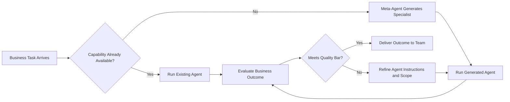
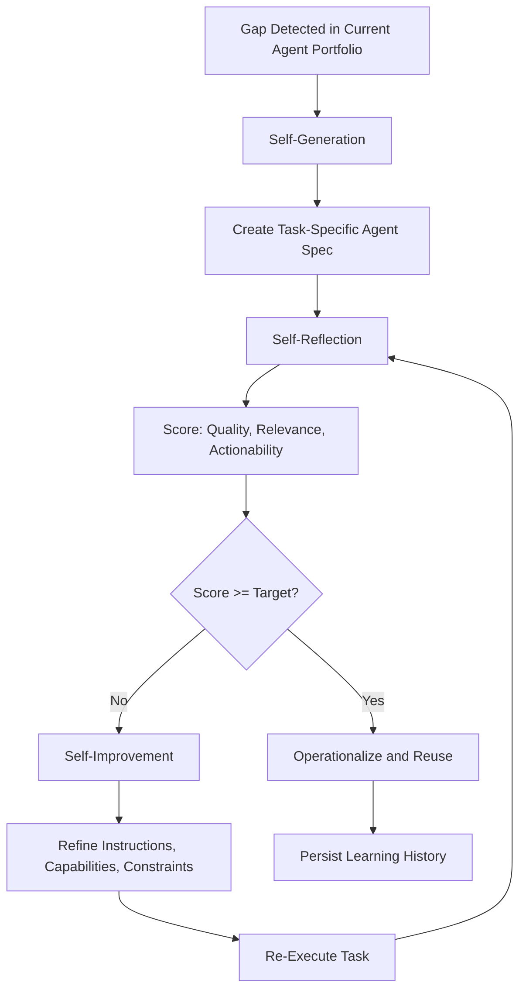
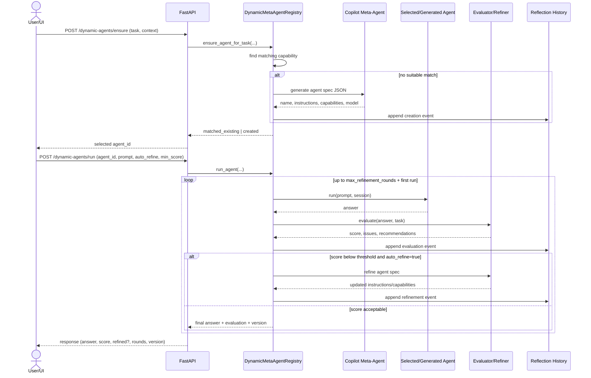

# Meta-Agent Closed Loop Guide

This document explains how EDISON PRO implements a closed-loop meta-agent system that can:

1. detect capability gaps,
2. generate new task-specific agents,
3. self-evaluate output quality,
4. refine agents automatically, and
5. re-run to improve outcomes.

## 1. Goal

The purpose of the meta-agent is to close gaps when no existing agent can solve a task with sufficient quality.

Instead of one-shot generation, the runtime performs a loop:

- Ensure agent for task
- Run agent
- Evaluate output
- Refine agent if needed
- Re-run (bounded rounds)

## 2. Core Components

- Runtime registry and loop orchestration:
  - `agents/dynamic_meta_agent.py`
- API surface:
  - `api.py`
- Frontend control panel:
  - `frontend/src/components/DynamicAgentStudio.tsx`
- Reflection history persistence:
  - `memory_atlas/dynamic_agent_reflection_history.jsonl`

## 3. High-Level Flow

## Visual Overview

### Business Diagram 1: Inner Loop Value Cycle



### Business Diagram 2: Self-Generation to Self-Improvement



### Technical Diagram 3: Runtime Walkthrough (API + Registry)



### Step A: Ensure agent

Endpoint:

- `POST /dynamic-agents/ensure`

Behavior:

1. check existing agent capabilities,
2. return existing match if sufficient,
3. otherwise create a new specialized agent via:
   - Copilot meta-agent path when provider is available, or
   - deterministic heuristic fallback.

### Step B: Run with self-reflection

Endpoint:

- `POST /dynamic-agents/run`

Important request controls:

- `task`: explicit target objective for evaluator/refiner
- `auto_refine`: enable/disable closed loop
- `min_score`: quality threshold to trigger refinement
- `max_refinement_rounds`: bounded refinement iterations

Runtime behavior:

1. execute current agent,
2. evaluate response quality,
3. if score < threshold and rounds remain:
   - refine instructions/capabilities,
   - increment agent version,
   - re-run,
4. return final answer plus evaluation/refinement metadata.

## 4. Self-Generation

Self-generation starts when `ensure` detects no suitable agent.

### Copilot-backed generation

When provider is available, the meta-agent produces a JSON spec:

- `name`
- `instructions`
- `capabilities`
- `model`

### Fallback generation

If provider is unavailable, the system creates a deterministic specialist spec from task terms.

## 5. Self-Reflection (Evaluation)

Each run is evaluated to measure task closure quality.

### Copilot evaluator mode

The evaluator returns structured JSON:

- `score` (0..1)
- `issues`
- `strengths`
- `recommendations`
- `should_refine`

### Heuristic evaluator fallback

A deterministic evaluator computes score using:

- semantic overlap between task and answer,
- response sufficiency (length/content),
- issue signals.

## 6. Self-Improvement (Refinement)

If evaluation is below threshold and refinement is enabled:

### Copilot refiner mode

A refiner agent updates the spec using evaluation signals:

- improves instructions,
- updates capability tags,
- preserves or adjusts model if needed.

### Heuristic refiner fallback

Recommendations are appended as refinement notes in instructions.

### Versioning

On each successful refinement:

- `version += 1`
- `last_refined_at` is updated

## 7. Reflection Memory and Audit

All key events are persisted as JSON lines to:

- `memory_atlas/dynamic_agent_reflection_history.jsonl`

Event types include:

- `creation`
- `evaluation`
- `refinement`

This provides a local audit trail and enables future analytics on agent improvement quality.

## 8. API Contract Summary

### Ensure

`POST /dynamic-agents/ensure`

Request:

```json
{
  "task": "Extract cable schedule rows from mixed discipline sheets",
  "context": {
    "domain": "engineering-diagrams",
    "priority": "high"
  },
  "allow_create": true
}
```

Response status values:

- `matched_existing`
- `created`
- `not_found`

### Run

`POST /dynamic-agents/run`

Request:

```json
{
  "agent_id": "cable-schedule-specialist",
  "prompt": "Extract cable ID, from, to, size, insulation, voltage class.",
  "session_id": "project-alpha-1",
  "task": "Generate normalized cable schedule output",
  "auto_refine": true,
  "min_score": 0.75,
  "max_refinement_rounds": 1
}
```

Response includes:

- `answer`
- `evaluation`
- `refinement_applied`
- `refinement_rounds`
- `agent_version`

## 9. Prerequisites

For full Copilot-backed generation/evaluation/refinement:

```bash
pip install agent-framework-github-copilot --pre
```

Also required:

- GitHub Copilot CLI installed
- GitHub Copilot CLI authenticated

Optional environment variables:

- `GITHUB_COPILOT_MODEL`
- `GITHUB_COPILOT_CLI_PATH`
- `GITHUB_COPILOT_TIMEOUT`
- `GITHUB_COPILOT_LOG_LEVEL`

If not available, the loop still works using heuristic fallback logic.

## 10. Operating Guidance

Recommended defaults:

- `auto_refine=true`
- `min_score=0.72` to `0.80`
- `max_refinement_rounds=1` for latency/cost balance

When to increase rounds:

- high-stakes outputs,
- repeated low scores,
- complex multi-constraint tasks.

When to disable auto-refine:

- strict latency constraints,
- exploratory runs where first-pass output is acceptable.

## 11. Known Limits

- Active registry state is persisted and restored, but cross-instance distributed coordination is not yet implemented.
- Reflection replay supports startup recovery, but replay-based reconciliation is best-effort if logs are externally modified.
- Fallback evaluator is significantly improved (multi-signal weighted rubric), but provider-backed evaluator is still preferred for highest fidelity.

## 12. Next Enhancements

Potential next steps:

1. Add policy-based approval gate before applying refinements.
2. Add offline analytics job over reflection history and run diagnostics.
3. Add convergence stop criteria beyond fixed rounds.
4. Add optional distributed backend (PostgreSQL/Redis) for multi-instance deployments.
